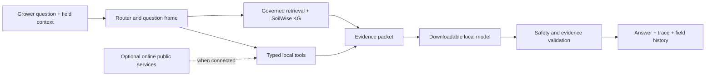

# Open Agronomy Agent

Open Agronomy Agent is a local-first research system for evidence-grounded Canadian field questions. It combines a small downloadable language model with a governed agronomy corpus, a soil-health knowledge graph, structured field history, deterministic tools, and an auditable answer trace. The same application can run without internet access in the field and use current public services when it reconnects.

This repository is a conference release candidate, not a finished agronomist replacement. It is designed to show its evidence, distinguish regional priors from field measurements, and stop when a safe recommendation requires a current label, laboratory result, local calibration, or professional review.

> **Licence status:** the owner is reviewing the public release. Until a root `LICENSE` is selected, the code is source-available for review but does not yet grant open-source reuse rights. Third-party data terms are separate and are recorded in [THIRD_PARTY_NOTICES.md](THIRD_PARTY_NOTICES.md).

## What is in the system



The release knowledge path includes:

- 718 lineage-bearing chunks of redistributed Canadian applied guidance, principally Alberta and Manitoba, plus federal and Saskatchewan material;
- 328 Canadian regional/context chunks covering Ontario statistics and federal or provincial data-product descriptions across crop-producing provinces;
- the SoilWise soil-health knowledge graph and 1,784 derived retrieval records under CC BY 4.0;
- a compact USDA NRCS ecological-site corpus used only as regional context, never as Canadian soil authority;
- project-authored safety boundaries and conceptual agronomy scaffolding.

The corpus policy is authoritative. A file being present does not make it admissible: unlicensed forum text, rights-unresolved OCR, evaluation-shaped answer material, and copied certification objectives are quarantined before indexing. See [Knowledge and data governance](docs/public/knowledge-and-data.md).

## Quick start on Apple Silicon

The tested local target is an Apple Silicon Mac with 16 GB unified memory. Python 3.11 or 3.12 and Node 20+ are recommended.

```bash
git clone https://github.com/Tknecht4/open_agronomy_agent.git
cd open_agronomy_agent

python3 -m venv .venv
source .venv/bin/activate
python -m pip install --upgrade pip
python -m pip install -r requirements.txt

cd frontend
npm ci
cd ..
```

Model weights are deliberately not committed. Download the pinned conference candidate, or replace the profile with another MLX-compatible local model:

```bash
python scripts/download_model.py \
  --model-config configs/model_gemma4_e2b_interface_v1.yaml
```

Run the API and frontend together:

```bash
PYTHONPATH=src python scripts/run_cockpit.py \
  --host 127.0.0.1 \
  --port 8000 \
  --frontend \
  --frontend-port 5173 \
  --model-config configs/model_gemma4_e2b_interface_v1.yaml \
  --warm-model
```

Open `http://127.0.0.1:5173`. Omit `--warm-model` during ordinary UI development.

## Offline and connected operation

The local model, admitted RAG/KG artifacts, field/session database, and deterministic calculator work without a network. Tools that require a live provider declare that requirement and are blocked before an external call in offline mode. Current weather, current legal labels, and live regulatory authority must never be simulated from stale local text.

The field-LAN launch path requires HTTPS and one-time client pairing. It intentionally blocks public adapters. See [Offline operation](docs/public/offline-operation.md).

## Structured agronomic calculator

Arithmetic is not delegated to free-text regexes or model intuition. The calculator accepts a named operation and explicit quantities, validates dimensions and ranges, uses decimal arithmetic, and returns the formula, inputs, units, assumptions, and safety boundary.

```bash
PYTHONPATH=src python -m agronomy_agent.tool_cli calculate unit_conversion \
  --inputs-json '{"value":100,"from_unit":"kg/ha","to_unit":"lb/ac"}'
```

Supported operations include unit conversion, seed-rate mass, fertilizer product mass, nutrient delivery, sprayer volume, tank coverage, growing degree days, row population, field totals, area-weighted averages, and partial budgets. The tool verifies arithmetic only; it does not choose a target rate or establish label compliance.

## Evaluation

The main internal benchmark contains 241 Canadian cases across four frozen causal arms:

1. raw model;
2. kernel only;
3. kernel plus the same structured field context;
4. governed retrieval/evidence path.

The 16 objective calculation cases are scored with numeric tolerances. Decision-quality cases remain development evidence and are not equivalent to blinded agronomist review. The held-out 256-question AgroQA set is an external transfer diagnostic, not a Canadian certification claim. The 28 CCA-aligned/local-style questions are project-authored coverage probes; they are not copied professional-exam questions and never enter runtime retrieval.

Run a no-model contract check:

```bash
PYTHONPATH=src .venv/bin/python scripts/run_open_agronomy_benchmark.py \
  --evaluation-set internal \
  --model-config configs/benchmark_models/gemma4_e2b.yaml \
  --model-key gemma4-e2b \
  --output-dir outputs/open_agronomy_canadian_performance_v1 \
  --preflight-only
```

For a real run, remove `--preflight-only`. Add `--resume-partial-runs` only when you want the runner to resume an identity-matched partial arm. Exact prompts, responses, context packets, run identities, and judgments remain under ignored `outputs/`. See [Evaluation contract](docs/public/evaluation.md).

## Verification

```bash
PYTHONPATH=src .venv/bin/python -m pytest -q
PYTHONPATH=src .venv/bin/python -m compileall -q src scripts

cd frontend
npm run typecheck
npm test
npm run build
```

Fast deterministic checks:

```bash
PYTHONPATH=src .venv/bin/python scripts/run_eval.py --mode baseline --mock --max-samples 3
PYTHONPATH=src .venv/bin/python scripts/run_eval.py --mode agronomic_rag --mock --max-samples 3
```

## Repository map

- `src/agronomy_agent/` — agent kernel, evidence fabric, retrieval, tools, trace and API services;
- `frontend/` — map-first React interface;
- `configs/` — model, RAG, benchmark and runtime contracts;
- `data/seed/` — small project-authored knowledge and boundaries;
- `data/derived/rag/` — only policy-admitted release RAG/KG artifacts;
- `data/manifests/` — source, rights, hash and governance records;
- `data/eval/` — internal and explicitly separated external evaluation data;
- `scripts/` — ingestion, audit, benchmark, packaging and operator utilities;
- `tests/` — deterministic contract, service and interface tests;
- `docs/public/` — maintained public documentation.

The React cockpit is the supported interface; the old prototype Gradio UI has been removed.

Historical research outputs, model caches, raw downloads, private overlays, mutable traces, benchmark responses, generated spatial databases, and internal planning notes are intentionally excluded from the public repository checkpoint.

## Safety and contribution boundary

Do not use the system as the sole basis for pesticide use, legal compliance, diagnosis, fertilizer prescription, financial commitment, or other high-consequence action. Confirm current labels and regulations, use representative field observations and laboratory data, and involve a qualified local professional when the decision warrants it.

Before accepting a new knowledge source, record item-level rights, publisher, URL, jurisdiction, currency, checksum lineage, retrieval role, and limitations. Do not train on or retrieve from held-out evaluation answers. See [Architecture](docs/public/architecture.md), [Knowledge and data governance](docs/public/knowledge-and-data.md), and [Evaluation contract](docs/public/evaluation.md).
