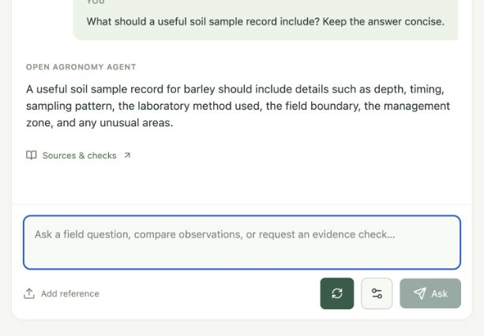

# Open Agronomy Agent

**A local-first field workspace and a customizable research-agent foundation.** Ask general agronomy questions, attach a field when it matters, inspect the sources and checks behind an answer, and keep observations distinct from mapped context and model output. The repository includes the React workspace, FastAPI service, pinned local model profile, governed document and graph retrieval, deterministic tools, tests, and evidence-preserving research workflows.



The screenshot shows synthetic example data. [Explore the workspace](docs/public/operations/workspace.md) · [Customize the agent](docs/public/developer/customizing-the-harness.md) · [Read the architecture](docs/public/architecture.md)

## What you can do

| Workspace | What it provides |
|---|---|
| Ask and inspect | General questions work without inventing a field. Answers expose sources, tool results, missing evidence, and the answer trace. |
| Build a field record | Name a field, optionally add crop and region, then pin, draw, or import its location. Review before saving; add observations and soil tests over time. |
| Use context carefully | Regional map layers, graph relationships, and dated public adapters can inform a question. They remain labelled priors, never field measurements or current label authority. |
| Bring data in | Inspect a private reference for the current browser session, import field boundaries and records, or use governed source-ingestion builders. These are distinct admission paths. |
| Extend the system | Change the pinned model profile, register a typed capability, add an admitted source or graph, and verify behavior through the production execution seam. |

This is a development and research system. It is not an agronomist replacement, diagnosis, pesticide-label authority, or evidence that a recommendation will work in a field. Confirm consequential decisions with current local authority, representative observations, and qualified professional judgment.

## Run locally

The exercised native target is an Apple Silicon Mac with 16 GB unified memory, Python 3.11 or 3.12, and Node 20 or newer. Install from the repository root:

```bash
git clone https://github.com/Tknecht4/open_agronomy_agent.git
cd open_agronomy_agent
python3 -m venv .venv
source .venv/bin/activate
python -m pip install --upgrade pip
python -m pip install -r requirements.txt
python -m pip install -e .
cd frontend && npm ci && cd ..
```

Model weights are not committed or fetched while answering. Provision the active Gemma 4 E2B profile explicitly:

```bash
python scripts/download_model.py --model-config configs/model.yaml
```

The serving snapshot is `mlx-community/gemma-4-e2b-it-4bit` at revision `238767527555cb75a05732a84dff5d6ba0dd6809`. It occupied about 3.34 GiB in the exercised cache; leave additional room for dependencies, indexes, runtime state, and generation.

## Data and optional spatial setup

The clone already contains the active hash-bound document and graph corpus,
including the context-only U.S. NRCS analogue pack. Normal question answering
does not require a second corpus download. Verify those checked-in bytes before
launching:

```bash
PYTHONPATH=src .venv/bin/python scripts/audit_runtime_corpus.py
```

Prairie map layers are different: the Alberta, Saskatchewan, and Manitoba
Detailed Soil Survey archives are not committed. The cockpit works without
them and reports map coverage as `not_installed`. To enable that optional
offline map context, choose a dedicated state directory outside the checkout,
inspect the one-time operation, and then run it:

```bash
PYTHONPATH=src .venv/bin/python scripts/setup_offline_data.py \
  --profile prairie-dss-v1 \
  --data-root /absolute/path/to/open-agronomy-state \
  --download --build --verify --dry-run

PYTHONPATH=src .venv/bin/python scripts/setup_offline_data.py \
  --profile prairie-dss-v1 \
  --data-root /absolute/path/to/open-agronomy-state \
  --download --build --verify

export AGRONOMY_AGENT_SPATIAL_PACK_ROOT=/absolute/path/to/open-agronomy-state/spatial-pack/prairie-dss-v1
```

The profile requires at least 1.5 GB free and pins the official source bytes.
Mapped soil context remains a regional prior, not a soil test or field truth.
See the [complete offline data procedure](docs/public/operations/offline-data-setup.md)
for verification, raw-archive retention, and RAG-only operation.

## Start the application

Start the API and workspace:

```bash
PYTHONPATH=src python scripts/run_cockpit.py \
  --host 127.0.0.1 --port 8000 \
  --frontend --frontend-port 5173 \
  --model-config configs/model.yaml \
  --warm-model
```

Open `http://127.0.0.1:5173` and check API readiness independently:

```bash
curl --fail --silent http://127.0.0.1:8000/api/health | python -m json.tool
```

Expect `"status": "ok"`; this verifies API configuration, not a completed model turn or an external provider. Stop the launch command with **Ctrl+C**. [Native setup and troubleshooting](docs/public/operations/native-setup.md) includes listener and recovery checks.

## Start in the workspace

Ask a general question directly, or choose **Add field** for a private field record. The three-step flow asks for a name, a pin/drawn boundary/imported GeoJSON, JSON, ZIP, or GPKG boundary, and a final review. Crop and region are optional. A calculated polygon area is an estimate, not a measurement. **Fields** contains Overview, Records & soil tests, and Map context; the question view keeps the map available on demand. **Sources & checks** opens the evidence behind a saved answer. The **Data** area distinguishes private session references from governed source and adapter status.

Offline drafts remain local until the API acknowledges a save or sync. Optional Prairie soil layers require a separate verified pack; unavailable layers and providers are reported rather than simulated. [Workspace guide](docs/public/operations/workspace.md) explains the full flow, ingestion boundaries, exports, and recovery.

## Build on this repository

The supported product path is `src/agronomy_agent/server/app.py` → `server/services/chat_service.py::execute_agent_request` → the typed production core. Active profiles live in `configs/model.yaml`, `configs/rag.yaml`, and `configs/runtime_profiles.json`. Capability selection belongs to the registry-driven planners; source and graph presence on disk never grants runtime authority. See [customizing the harness](docs/public/developer/customizing-the-harness.md) for exact extension seams, ingestion routes, checks, and claim limits.

Development profiling is reproducible without a provider call by default:

```bash
PYTHONPATH=src .venv/bin/python scripts/profile_workspace_backend.py \
  --output-dir /tmp/open-agronomy-backend-profile
```

The explicit pinned-model profiler requires a locally provisioned snapshot and `--execute-local-pinned`; both write non-claim receipts to a new output directory. The [measured backend findings](docs/reviews/artifacts/ui-backend-findings-20260927.md) report cold-start and two local Gemma turns, including the timing and memory limits. They are diagnostics, not latency budgets or answer-quality evidence.

Artifacts use the configured local filesystem, request limits are in memory, and records use the application database (SQLite by default). Redis queues/rate limits and S3-compatible storage are unsupported; retired namespaced settings fail closed. Retained Postgres and identity-provider interfaces are separate and are not newly deployment-qualified.

## Evidence and contribution boundaries

The checked-in active corpus is hash-admitted and includes Canadian evidence, project policy, SoilWise context, and a 218,258-row U.S. NRCS analogue pack available only for explicit U.S./MLRA comparison. U.S. material cannot establish Canadian decisive authority. Evaluation cases never enter runtime retrieval or training. Runtime databases, traces, model caches, private overlays, credentials, and raw benchmark answers stay outside the public package. Historical RC1–RC3 and the [current two-Gemma assessment](docs/public/two-gemma-colab-assessment-20260926.md) retain their original identities; passing tests or a small profile does not establish agronomic competence.

Project-authored content is [Apache-2.0](LICENSE). Third-party data, evaluation material, dependencies, and model weights keep their own terms; consult [third-party notices](THIRD_PARTY_NOTICES.md). The [documentation site](docs/public/index.md), [governance guide](docs/public/governance.md), and [evaluation contract](docs/public/evaluation.md) explain evidence, privacy, and claim limits.

Before a repository-wide claim, run the Python suite, public-doc checker, strict MkDocs build, and frontend typecheck/tests/build listed in [release readiness](docs/public/developer/release-readiness.md). Run corpus, retrieval, release, or model gates when their controlling inputs change.

Maintainer references: [repository architecture](ARCHITECTURE.md), [coding-agent guidance](AGENTS.md), and [repository map](docs/public/developer/repository-map.md).
