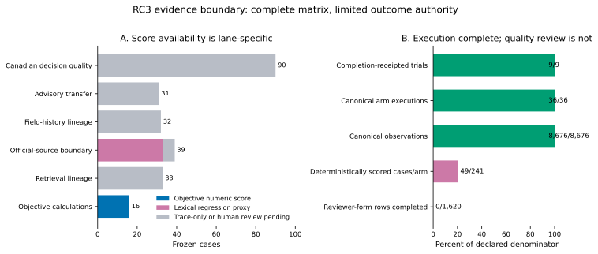
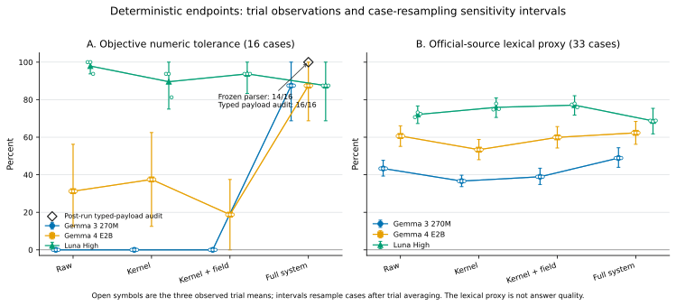
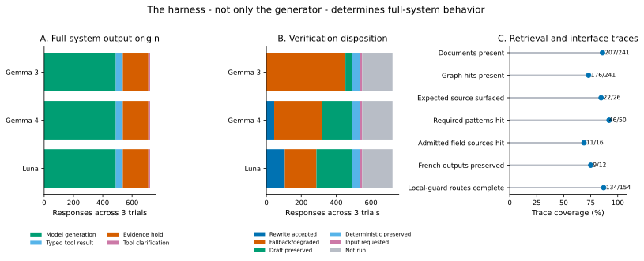
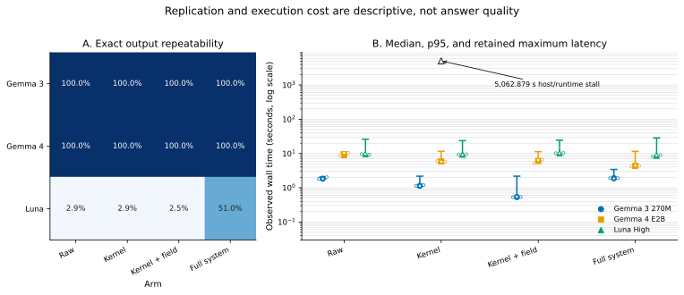
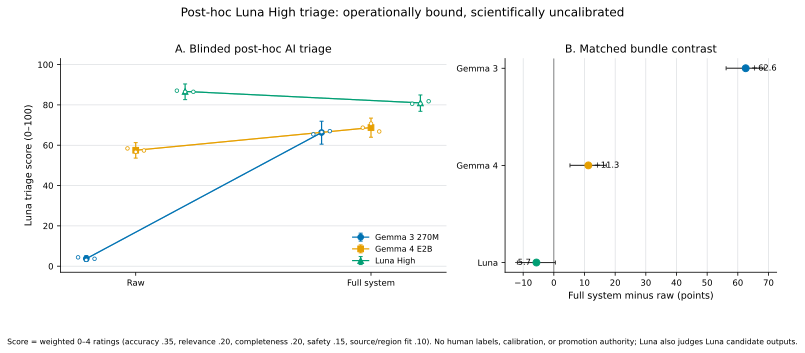

# RC3 development benchmark checkpoint — 2026-08-15

RC3 completed the planned 3-candidate × 3-trial × 4-arm × 241-case matrix: 8,676 canonical observations in 36 isolated executions. All nine trials have completion receipts and verified content-addressed retention bundles. This is a strong harness and reproducibility checkpoint.

It is **not** a model-quality leaderboard or a Benchmark v3 result. The suite is project-authored, exposed, and used during system tuning; no real-user cases or independent agronomist judgments are present. The 90-case Canadian decision-quality lane and 31-case advisory-transfer lane remain unscored. The concise interpretation is the [checkpoint paper](paper.pdf).

## What was measured

Only 49 of 241 cases per arm have a defined deterministic result:

- 16 objective calculations use a frozen numeric/unit/tolerance scorer;
- 33 of 39 official-source boundary cases have a lexical-contract regression proxy;
- 192 cases are trace-only or await independent human review.

The deterministic results therefore diagnose calculation, prompt-contract, and harness behavior. They do not measure overall agronomic correctness.

## Separate post-hoc Luna High triage

After RC3 generation completed, a separately authorized, blinded Luna High process reviewed the 90 raw/full decision-quality pairs in each of the nine candidate trials: 1,620 saved answers in total. This did **not** modify the frozen RC3 observations, databases, or deterministic scores.

The process reports an internal 0--100 weighted rubric: agronomic accuracy (0.35), decision relevance (0.20), completeness/actionability (0.20), calibration/safety (0.15), and crop/region/source fit (0.10); each dimension is rated 0--4. It is an uncalibrated AI triage diagnostic, not a semantic-quality estimate, composite score, ranking, or release criterion. There are no human labels, calibration cases, inter-rater statistics, or agronomic adjudications, and Luna judges saved Luna candidate answers. The public controls table records 1,620 terminal reviews, but also records 99.3% judge self-reported high confidence and nonzero score variation for repeated identical answer text; neither is a reliability estimate.

| Candidate configuration | Triage raw | Triage full | Full minus raw |
|---|---:|---:|---:|
| Gemma 3 270M | 3.73 | 66.30 | +62.57 |
| Gemma 4 E2B | 57.50 | 68.76 | +11.25 |
| Luna High | 86.68 | 81.00 | -5.68 |

These contrasts are hypotheses for independently calibrated agronomist review. They do not establish that the full system improved, that Luna is preferable, or that any answer is agronomically correct.

| Candidate configuration | Objective: raw / kernel / field / full | Lexical proxy: raw / kernel / field / full |
|---|---:|---:|
| Gemma 3 270M | 0.00 / 0.00 / 0.00 / 87.50 | 43.33 / 36.63 / 38.94 / 48.91 |
| Gemma 4 E2B | 31.25 / 37.50 / 18.75 / 87.50 | 60.65 / 53.36 / 59.93 / 62.34 |
| Luna High | 97.92 / 89.58 / 93.75 / 87.50 | 72.11 / 75.92 / 77.10 / 68.69 |

The full-system calculation score is the frozen parser result: 14/16. A post-run audit found that the typed calculator produced a within-tolerance payload on 16/16; the two false negatives used the correct generic unit `kg product/ha`, which the frozen product-specific alias set rejected. This package preserves 14/16 and reports 16/16 only as an explicitly labelled parser-sensitivity audit.

## What the harness demonstrated

- Full-system execution per trial comprised 163 model generations, 16 deterministic tool results, 58 evidence-sufficiency holds, and 4 missing-input clarifications.
- Retrieval surfaced the expected source in 22/26 positive retrieval cases and matched 46/50 required retrieval patterns. These traces are invariant across candidates and trials and are not answer-quality scores.
- Among field-history expectations, 11/16 sources admitted to the current Canadian master appeared. Thirteen expected sources were intentionally unadmitted and did not leak; 29 prospective decision-card IDs across 28 cases were absent from runtime.
- The local temperature-zero MLX configurations were byte-identical across all three fresh-process trials. Luna was exact across trials on 7/241 raw cases and 123/241 full-system cases; these are repeated calls, not independent seeded samples.
- Interface traces were complete for input lineage, field binding, routing, context admission, and evidence lineage. Two defects remain visible in the frozen observations: French was preserved on 9/12 eligible cases, and expected local guards were complete on 134/154 eligible cases.
- Luna used 2,841 candidate/answer-verifier calls and 10,919,444 total tokens. The recorded USD 3.0463 is an API-equivalent estimate only; actual ChatGPT-authenticated billing and local energy use were not observed.

## Visual checkpoint











## Package map

- `paper.pdf`, `main.tex`, `references.bib` — checkpoint paper and reproducible source;
- `generated_results.tex`, `generated_tables.tex` — generated manuscript values;
- `paper_evidence_manifest.yaml` — claim-to-evidence and limitation map;
- `figures/*.svg` and `figures/*.pdf` — vector scientific figures;
- `source_data/public_safe_response_measurements.csv` — 8,676 answer-free, prompt-free observation measurements;
- `source_data/*_summary.csv` — analysis-ready deterministic, retrieval, harness, repeatability, and resource tables;
- `source_data/posthoc_semantic_review_*` — aggregate-only post-hoc Luna triage scores, matched contrasts, and uncalibrated quality controls;
- `source_data/checkpoint_validation_receipt.json` — matrix, retention, and known-finding receipt;
- `source_data/analysis_manifest.json` and `source_data/artifact_manifest.json` — input/output identities without machine-local paths;
- `scripts/analyze_rc3_checkpoint.py` — the canonical regeneration and verification entry point.

Raw answers, prompts, SQLite databases, logs, model weights, and machine-local paths are intentionally excluded from this public checkpoint.

## Reproduce

With the nine private completion-receipted trial directories available under the default output root:

```bash
python3 -m pip install -r requirements-benchmark-analysis.txt
python3 docs/public/development-benchmark-rc3-20260815/scripts/analyze_rc3_checkpoint.py
```

Compile the manuscript with Tectonic, then finalize and verify the package:

```bash
cd docs/public/development-benchmark-rc3-20260815
tectonic main.tex
mv main.pdf paper.pdf
cd ../../../..
python3 docs/public/development-benchmark-rc3-20260815/scripts/analyze_rc3_checkpoint.py \
  --finalize-package
python3 docs/public/development-benchmark-rc3-20260815/scripts/analyze_rc3_checkpoint.py \
  --verify-published
```

The fixed-suite sensitivity intervals use 50,000 case resamples after averaging the three observed trials within each case. Resample indexes are shared across candidate and arm cells within each metric family; the base seed is `20260815` with metric-family offsets `0/1`, while paired arm contrasts use offsets `1000/1001`. They describe sensitivity to the composition of this exposed case set; they are not population confidence intervals or human-agreement intervals.

## Next evidence required

Independent two-phase agronomist review of the retained packets, with calibration and adjudication, is the next quality gate. Benchmark v3 additionally requires an untouched prospective holdout, a true component matrix, identical cross-candidate harness policies where causal comparison is intended, and preregistered promotion criteria. Until those gates are complete, RC3 remains a nonclaim development checkpoint.
