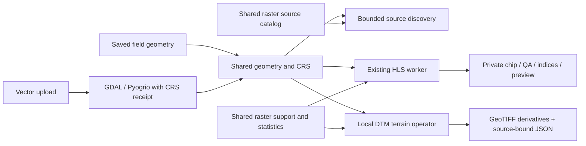

# Geospatial foundation and terrain screening

The app now shares geometry, source definitions and raster support between map services, HLS imagery and a new terrain operator path. This is the first development slice: source discovery is available through the app API and CLI; terrain runs on an explicitly prepared local DTM. Government DEM acquisition, mosaicking and an interactive terrain UI are not yet connected.

## Data flow and ownership



Source definitions are code, field records remain in the app database, installed regional vectors remain spatial packs, and raster products remain private artifacts. These serve different purposes. The next integration step is a common product manifest/index over those stores, with one field/geometry identity and one job contract—not a wholesale database migration.

| Concern | Library | Application responsibility |
|---|---|---|
| Topology and complete polygon geometry | Shapely | Allowed types, size limits, invalid-input errors; no silent repair |
| CRS transforms and geodesic measurements | PyProj | Explicit CRS/axis units, offline grids, datum evidence |
| SHP/GPKG parsing and reprojection | GeoPandas/Pyogrio/GDAL | Archive bounds, no remote references, byte/CRS receipts |
| Raster windows, masks, affine grids and exports | Rasterio/GDAL | Native-grid policy, byte/cell budgets, QA/nodata semantics |
| Cell/field intersection | Vectorized Shapely + Rasterio | Float64 support and validity denominators |
| Slope, conditioning, D8 routing and accumulation | PyFlwDir | Context extent, edge uncertainty, scientific interpretation |

Projection does not establish a vertical transformation. PROJ networking is disabled in the shared transformer; required grids must already exist. SHP/GPKG missing or ambiguous CRS is rejected. Full holes/multipart topology is preserved by the core importer; the current single-ring field editor rejects it explicitly instead of selecting one part. Regional overlap is geodesic area of the actual intersection; retained confidence numbers are labelled heuristics, not calibrated probabilities.

## Sources beyond Planetary Computer

| Source | Access and current implementation | Domain limits |
|---|---|---|
| NRCan HRDEM 1 m / 2 m mosaics and LiDAR projects | Keyless STAC metadata; anonymous DTM COG links. Metadata adapter implemented | Coverage/age vary; 2 m DSM coverage exceeds DTM coverage. Actual pixel support must be read |
| USGS 3DEP project 1 m and seamless S1M | Separate keyless TNM definitions and bounded metadata adapter | S1M coverage incomplete. Live product queries failed during research; errors remain `provider_unavailable` |
| Earth Search Sentinel-2 C1 | Keyless discovery and bounded polygon operator; anonymous pixels | Independent scale/offset, native 20 m grid and SCL/source QA; source-screened, not field-validated |
| Earth Search Copernicus GLO-30 | Keyless metadata and anonymous assets | Coarse DSM, with vegetation/buildings; not a bare-earth field-drainage fallback |
| Earth Search NAIP | Keyless metadata discovery only | Inspected analytical assets declare requester-pays; no account or automatic pixel acquisition |
| RCM CEOS ARD | Research candidate, no adapter yet; anonymous AWS access documented | Separate public-user terms and SAR calibration/geometry requirements |
| AAFC crop/soil/context layers | Existing regional/data adapters retained | Classified/mapped context is not field truth; avoid creating another parallel AAFC path |

The [NRCan mosaic guide](https://nrcan.github.io/CanElevation/stac-dem-mosaics/), [USGS 3DEP product guide](https://www.usgs.gov/3d-elevation-program/about-3dep-products-services), [Earth Search API](https://github.com/Element84/earth-search/blob/main/README.md) and [RCM ARD registry](https://registry.opendata.aws/rcm-ceos-ard/) describe the source products. Access and licensing are separate. Public catalog access does not guarantee anonymous pixels or redistribution/training permission.

A live NRCan sample was approximately 898 GB. Do not download complete mosaics. Its STAC `proj:transform` used GDAL coefficient ordering; processing must read the actual raster header. Discovery reports that the grid and pixel coverage are unverified, and never interprets mosaic publication time as acquisition time.

## Inspect sources and metadata

```bash
PYTHONPATH=src .venv/bin/python scripts/discover_field_sources.py --catalog

PYTHONPATH=src .venv/bin/python scripts/discover_field_sources.py \
  --geometry /absolute/private/field.geojson \
  --source-id ca-hrdem-mosaic-1m --context-buffer-m 250 --limit 3 --online
```

Without `--online`, discovery returns `blocked_offline` and makes no request. Online discovery sends the geometry/extent to the selected provider. It fetches at most one page, at most ten records and at most 2 MiB of metadata. No pixel assets or pagination URLs are followed. A context buffer plans a search extent; it does not prove a complete upstream catchment. `no_records` means an empty returned catalog page, not verified absence of coverage. Provider errors and malformed/unknown records are kept separate.

The service exposes `GET /api/geo/sources` and the workspace-authorized `POST /api/demo/fields/{field_id}/geospatial/discover`. Example JSON body:

```json
{"source_id":"ca-hrdem-mosaic-1m","context_buffer_m":250,"limit":3}
```

The latter uses only saved field geometry, respects service offline mode, and rejects in-flight results if that geometry changes. Arbitrary URLs, credentials and filesystem paths are not accepted. Existing `/imagery/search` and provider IDs remain compatible. Raster source definitions are centralized; regional vector/service definitions still live in their existing adapter registry pending a later common catalog view.

## Run terrain on a prepared local DTM

Use an isolated environment with `requirements-geospatial.txt`. Direct raster/terrain versions are pinned there; vector imports use bounded package versions. GeoPandas/Pyogrio are also required by the normal serving/package installation so existing SHP/GPKG uploads retain their supported path. The serving environment is not modified automatically. `--readiness` reports installed packages, not scientific qualification.

```bash
python3.12 -m venv /absolute/path/to/geospatial-venv
/absolute/path/to/geospatial-venv/bin/python -m pip install -r requirements-geospatial.txt
PYTHONPATH=src /absolute/path/to/geospatial-venv/bin/python scripts/analyze_field_terrain.py --readiness
```

Supply a **single-band, unscaled, north-up, square-cell GeoTIFF DTM in projected metres**, with complete terrain surrounding the field. The current processor requires an explicit bare-earth declaration, vertical metres and a named vertical datum; it does not reproject, vertically transform, fill missing DEM data or mosaic inputs. The default `auto` preprocessing applies a focal mean followed by bilinear resampling to 5 m when the actual input cells are 1 m; other resolutions remain native. Rejecting unsupported inputs is intentional at this foundation stage. Local source files are limited to 512 MiB and native read rectangles (including any preprocessing halo) and processing grids to one million cells. Native storage-block and GDAL cache limits also apply. The source file is hashed without being modified.

Example source metadata structure; fill it from the selected product's actual documentation:

```json
{
  "source_id": "selected-provider-product-item",
  "source_url": "https://official.example/product-metadata",
  "source_date": "documented date with its acquisition/publication meaning",
  "license": "applicable source licence and attribution",
  "terrain_type": "DTM",
  "bare_earth": true,
  "vertical_units": "m",
  "vertical_datum": "documented datum"
}
```

These values are **operator assertions**, recorded as such. Copying a collection-level datum into the receipt does not verify the selected raster or resolve contradictory metadata.

```bash
PYTHONPATH=src /absolute/path/to/geospatial-venv/bin/python scripts/analyze_field_terrain.py \
  --dem /absolute/private/field-with-context.tif \
  --geometry /absolute/private/field.geojson \
  --source-metadata /absolute/private/source.json \
  --context-buffer-m 250 --max-cells 1000000 --include-twi \
  --preprocessing auto --focal-window-cells 5 \
  --output-dir /absolute/private/new-terrain-bundle
```

The DEM must cover the full buffered field bounding rectangle plus a real-data smoothing/resampling halo; the minimum buffer is two processing cells, not a scientifically sufficient catchment guarantee. Hydrology runs on that full rectangle. Only the statistics are restricted to fractional field support. GeoTIFFs retain the context, grid and field-fraction mask so GIS users can inspect boundary effects.

Outputs are preprocessed unconditioned DEM, conditioned DEM, potential depression-fill depth, preprocessed-DEM slope (m/m), D8 directions, contributing area, field fraction, data-validity and edge-influence masks; optional TWI includes its own validity mask. `terrain.json` records source/output hashes, full CRS/grid, geometry, dependency versions, method, operator declarations, field statistics and limitations. Existing output directories are refused. Files are standard GeoTIFF, not asserted to be COGs.

### One-metre DEM preparation

The default profile uses a **5×5 square focal mean in the native 1 m grid**, then **bilinear resampling to 5 m**, before any slope, depression conditioning, D8 flow or TWI calculation. This is an explicit processing choice motivated by high-resolution DEM artifacts, not a universally optimal smoothing scale. Use `--focal-window-cells 3` (or another odd width from 3 to 31) for a sensitivity experiment. `--preprocessing native` retains an unsmoothed comparison; `--preprocessing focal_mean_5m` explicitly requests the profile and rejects non-1 m inputs. No upsampling is implicit.

[SciPy's focal mean](https://docs.scipy.org/doc/scipy/reference/generated/scipy.ndimage.uniform_filter.html) runs in float64. The processor reads a halo containing the focal radius plus two target-cell widths, rejects missing/nonfinite values throughout it, and discards artificially padded focal edges. [Rasterio/GDAL bilinear resampling](https://rasterio.readthedocs.io/en/stable/topics/resampling.html) then uses a 5 m grid anchored to the source origin; the field boundary does not set a new grid origin. QA/category rasters are not smoothed by this operation. The native source file stays unchanged.

Prepared bundles add `dem_native_m.tif` on its original native grid (including the halo) and `dem_preprocessing_delta_m.tif` on the processing grid. The latter compares the smoothed result with an unsmoothed bilinear reference on the **same 5 m grid**: it measures preprocessing sensitivity, not error against a surveyed DEM. `terrain.json` records the requested/resolved profile, focal footprint, order, source window, both grid roles, library versions, hash identities, delta statistics and declared vertical accuracy (unknown if absent). The native artifact has its own grid; consumers must not assume every artifact uses the processing grid.

Smoothing can suppress real ditches, berms and small depressions. Select the footprint using site-specific evidence and retain comparisons. USGS [hydro-flattened DEMs are not hydro-enforced drainage surfaces](https://www.usgs.gov/ngp-standards-and-specifications/lidar-base-specification-appendix-2-hydro-flattening-reference); smoothing does not add culverts, tile drains or missing catchment context.

The implementation calls [PyFlwDir conditioning and slope](https://deltares.github.io/pyflwdir/latest/_modules/pyflwdir/dem.html) and [accumulation](https://deltares.github.io/pyflwdir/latest/_generated/pyflwdir.FlwdirRaster.accuflux.html). Conditioning assumes edge outlets. Contributing area includes each cell's own projected area; any cell downstream of a processing-edge cell is marked unknown. TWI uses `ln((A / cell_width) / slope)` with preprocessed unconditioned-DEM slope and one cell width for all D8 directions. Zero slope, edge influence and undefined values remain nodata; no hidden slope floor or pseudocount is inserted. PyFlwDir uses float32 priority elevations/slope, so tiny vertical differences may be unresolved.

Fill depth is a model's terrain modification, not ponding depth. TWI is a conditional topographic index, not a drainage diagnosis. Culverts, tile drains, ditches, soil hydraulic properties, compaction, groundwater, rainfall and vertical error can dominate actual wetness. D8/grid/outlet sensitivity and comparison with field observations remain required before agronomic use.

## Existing imagery and next gates

HLS point and polygon processing uses shared source-extent masking, native 30 m support and float64 area reductions. The current v4 recipe validates actual COG and STAC radiometry, keeps water and cloud-quality flags distinct, and reports index support separately from QA-clear support. Negative input reflectance and nonpositive sums do not produce normalized NDVI/NDMI under this documented policy; clear reflectance observations remain available independently. The UI shows the distinction.

New chips retain pre-QA encoded `raw_dn` and `source_invalid_mask` alongside processed bands, Fmask, weights and indices. These source windows are bound into chip identity; they permit QA replay on retained window pixels but do not preserve the full remote COG or every per-band source mask. Outside-source pixels remain explicitly invalid. HLS source fill and saturation codes are provider-specific; this recipe must not be applied unchanged to Sentinel-2 L2A or another collection.

The v4 process IDs invalidate old request identities without altering historical files. An older v3 cache cannot satisfy a v4 offline request; frozen v2 research gates also remain frozen. Cached reads must pass current receipt consistency and file-integrity checks. NASA HLS already performs atmospheric correction, nadir-view normalization and bandpass adjustment, so the app does not repeat these steps. See the source-linked [satellite QA audit](https://github.com/Tknecht4/open_agronomy_agent/blob/main/docs/reviews/satellite-preprocessing-audit-20260929.md) and [development plan](https://github.com/Tknecht4/open_agronomy_agent/blob/main/docs/reviews/geospatial-preprocessing-round-20260929.md).

The next development gates are:

1. A bounded acquisition worker: verified DTM asset roles, actual-header/coverage/vertical metadata, byte/time/disk budgets, contextual COG windows and source receipts. Validate one Canadian and one US field before enabling routine acquisition.
2. A shared product manifest/index over existing storage, job status/cancellation, quota/retention and private backup/export. Do not delete historical chips or collapse all stores merely for uniformity.
3. Sentinel-2 processing as a separate radiometry/QA adapter using the common raster contract; explicit grid/resampling rules, scene choice, cloud-valid field coverage and temporal semantics. Use PySTAC Client for expanded STAC search, and rioxarray/stackstac only when a real cube workflow needs them.
4. Terrain qualification: multiple extents/resolutions, alternate routing/conditioning/outlet assumptions, source accuracy, real field checks and observed wetness. Keep observation, model output and interpretation separate.
5. Thin map/imagery/terrain UI and governed chat consumers of verified product manifests, with stale-geometry invalidation and authority limits. Raw files and discovery records do not enter retrieval/training automatically.

## Sentinel-2 Collection-1 polygon operator

The optional imagery operator also supports `sentinel2-c1-earth-search`. It shares bounded transport and the existing private chip store with HLS, while using independent Sentinel-2 radiometry, QA and processing identities. Install the optional geospatial requirements in the operator environment; no account or API key is needed for the admitted Earth Search assets.

```bash
PYTHONPATH=src python scripts/analyze_field_imagery.py \
  --provider sentinel2-c1-earth-search \
  --geometry /absolute/path/to/field.geojson \
  --start-date 2024-05-01 --end-date 2024-06-15 \
  --cloud-buffer-m 60 --edge-buffer-m 20 \
  --cache-root /absolute/path/to/private-sentinel2-cache --online
```

Omit `--online` for exact verified cache reuse. Date discovery selects one latest scene; no-scene, unsupported source, missing dependencies, storage refusal and empty valid area remain explicit. An exact `--scene-id sentinel-2-c1-l2a:ITEM_ID` can replace the dates. This first adapter supports polygons only; HLS point/buffer/context options do not apply. Cloud buffering accepts 0–200 m in 20 m steps; the field-interior margin accepts integer 0–200 m. These parameters are included in request and processing identities.

The analysis uses a source-anchored 20 m grid. Native 10 m blue/green/red are area-averaged only where all contributors are valid; native 20 m B8A/SWIR/SCL retain their support. It reports B8A-based NDVI and B8A/B11 NDMI, with separate QA-clear, index-eligible and interior support. Empty interior support is null. This is not a native 10 m product or a promise of HLS-equivalent time-series values. Source metadata, raw per-band DN/validity windows and processed arrays are stored in the NPZ; their separate grids and hashes are declared in the receipt and NPZ metadata.

Radiometry is decoded once from the admitted source encoding, with actual header agreement, nodata checks, SCL exclusions, configurable cloud/shadow adjacency and source-edge screening. Negative reflectance is preserved in source windows, but does not contribute to normalized indices. Mean solar zenith above 70° is refused. Earlier processing baselines have documented swath-edge limitations; detector-footprint masks are not available in the inspected C1 assets, and the receipt retains this qualification. A clear index is not a crop diagnosis or a field observation of drainage. See the [source-linked development record](https://github.com/Tknecht4/open_agronomy_agent/blob/main/docs/reviews/sentinel2-preprocessing-round-20260929.md).

The Sentinel-2 v2 recipe masks source nodata (DN 0) and saturation (DN 65535) before aggregation and decoding, retaining separate native saturation masks. Its fixed 20 m source-validity guard remains active when the optional field-interior margin is zero. This guard does not replace missing detector-footprint masks for pre-05.13 swath-edge artifacts.
