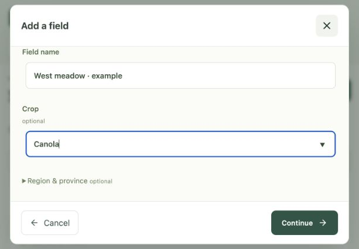

# Use the field workspace

The workspace puts a question and its selected field together. **Workspace**, **Fields**, and **Data** are the primary views; **Evidence**, **Benchmarks**, **Privacy**, and **About** are under **More**. The interface is a client of the local API. A page that loads does not establish that the model or optional data providers are ready; check [native setup](native-setup.md) and `/api/health` separately.

The image uses synthetic records. It contains no personal field data.

## Ask a question

Open **Workspace** and type a general question. A field is optional: the app must not invent a crop, location, soil test, or measurement to make a general question look field-specific. If the local runtime is unavailable, the text remains a device-local draft; sending it later requires a working API. A saved answer can show source cards, tool use, missing inputs, and a trace through **Sources & checks**. These records show what the system did, not that its answer is correct.

Select a field when its known details matter to the question. Field observations and soil tests are user records; map intersections and provider data are separate contextual inputs. If a field is incomplete, leave unknowns blank and ask a bounded question. A model answer should not turn an unknown into a zero, a pass, or a prescription.

## Map and connected sources

Use **Conversation**, **Together**, or **Map** to give the current task more room.
Smaller windows switch between conversation and map; the map can scroll with the
page so its field details remain accessible. Set-field, weather, and model menus
close when you click elsewhere, press Escape, or change views.

Connected mode loads public imagery and regional context. Source checks may send
a point, map bounds, or a field boundary to the selected provider. Map browsing is
separate from the source receipts retained with an answer. The Privacy view explains
these boundaries.

The weather summary reports actual published observation dates and coverage for
each metric. Recent NASA POWER windows can be partial because observations lag the
requested dates. A partial total is not a full-window total; missing values are not
zero rainfall. **Sources & checks** preserves these limits with the saved answer.
A missing public-knowledge readiness report remains unavailable, even when other
online providers work.

## Map explorer and field insights

Open **Map & layers** on the map to choose **Satellite**, **Streets**, or **Simple**.
The choice preserves the current view and boundary. Satellite uses Esri imagery;
Streets uses OpenStreetMap. Simple removes external basemap tiles so the boundary
and selected context remain easy to read. In offline mode only Simple and installed
context layers are available. Style and layer preferences stay in this browser.

Choose up to four context layers. The color keys identify the visible overlays;
**Layer shading** adjusts their prominence. An information button opens a layer's
source and limitations. Uninstalled layers stay in a collapsed list. Tooltips name
the mapped zone; a click opens its source. Missing source responses are distinct
from a valid result with no match. These display controls do not change the field
record or the source checks attached to an earlier answer.

**Field insights** opens a compact analysis of the current saved boundary or
example. Area, boundary length, and a location inside the shape are computed
without a model. Boundary measurements appear independently of slower map-source
lookups. The hectare/acre switch changes display units only. **Boundary details**
contains the location and calculation method. If recorded
acreage differs materially from the computed boundary area, both are labelled;
neither overwrites the other. Pins have a location but no inferred area.

For selected context layers, coverage uses clipped source polygons and geodesic
area. It does not reinterpret the older vertex-sampling match scores as area.
A layer's overall coverage uses the union of its source shapes; individual named
zones may overlap, so their percentages need not add to 100%. Empty matches are
collapsed; unavailable, partial, offline, and uninstalled states remain explicit.
Open a coverage row for the zone breakdown, area, source, and method.
Partial-source warnings remain visible even while that detail is closed.
Generalized or historical mapping remains context rather than a field survey,
soil test, crop observation, or recommendation.

New native and container installations include `pyproj` and `shapely`. Existing
environments should refresh their supported requirements to enable analysis;
without those libraries the API reports unavailable. Optional soil-map packs are
still separate. The interactive endpoint limits each request to four explicit
layers, 1,024 input positions and a 128 KiB geometry. Very large, invalid, or
antimeridian-crossing boundaries are rejected rather than silently simplified.
The editor still accepts a single exterior field ring; the analysis API also
supports validated holes and multipart polygons with local map packs. The legacy
online query path cannot establish complete coverage for those shapes, so remote
results remain explicitly partial with unknown total coverage.

Basemap tiles load only for the visible map; the app does not prefetch or package
them for offline use. Keep provider attribution visible. OpenStreetMap service use
follows its [tile usage policy](https://operations.osmfoundation.org/policies/tiles/);
Esri imagery credits follow the [provider's current service metadata](https://server.arcgisonline.com/ArcGIS/rest/services/World_Imagery/MapServer).

## Add and manage a field

1. In **Fields**, select **Add field**. Enter a field name; crop, region, and province are optional. Reusing the region from a previous field is an explicit action, not an automatic assumption.
2. Place a pin, draw a boundary, enter coordinates, or import one from `.geojson`, `.json`, `.zip`, or `.gpkg`. For files with multiple features, choose the intended field. A pin is enough to start; a full boundary can be edited later. The map checks geometry before save.
3. Review the location and any imported provenance note, then save. A polygon-derived acreage is an estimate. A pin does not establish acreage.

**Fields** has **Overview**, **Records & soil tests**, and **Map context**. Overview holds supplied details; Records & soil tests retains observations, measurements, corrections, and linked answer history; Map context shows regional matches with source and uncertainty. Field-event sync and recovery are available with the records. A browser draft is not a synchronized record until the API confirms it.

**Add record** opens a focused entry form; **Correct** beside an existing record
preselects it for an append-only correction. The original remains in the timeline.
**Add soil test** retains the exact report value, unit, method, depth and sample ID.
Enter the sampling date only when known, and explicitly mark whether you retained
the original report. Entry time and sampling time are different facts: sample rows label their recording
time, and sampling dates remain explicit or unknown in field context. Failed save
confirmations keep the form values, but the server may already have saved the record;
check the timeline before retrying. **Resume unsaved record** reopens a failed
record form that was closed. A pending save can be dismissed without cancelling
the request or enabling another submission.

The timeline shows concise summaries. Open **Record details** for capture and
measurement metadata, or expand an answer for its full text and provenance.
**Show more** reveals older loaded records without replacing the current view.

Deletion is explicit. The field library can remove the selected field record while historical answer records remain retained by the server; review the confirmation carefully. No map class, graph edge, or regional statistic replaces a representative soil sample or field observation.

## Add a private reference or governed source

The **Data** view can inspect a private PDF, plain-text, Markdown, or JSON reference for the current browser session. The inspect route accepts up to 5 MB for PDF and 1 MB for text formats. It reports low-text PDFs as blocked rather than silently applying OCR. Parsed chunks are unverified context and are not retained by that inspection route or made training-eligible. Clear the browser session when that context is no longer needed.

Boundary import is a separate field-geometry path. An imported field file does not become a retrieval source. Attached images and workspace data sources have their own API/storage and job states; availability depends on the configured backend and authority. The current **Data** view presents private references, Canadian knowledge coverage, and adapter diagnostics. Governed repository ingestion is an operator workflow, not a one-click promotion from this view.

To add material to the shared runtime corpus, start from a publisher/source receipt with exact bytes or URL, date, rights, jurisdiction, and hashes. Use the relevant deterministic ingestion/build script, validate row-level lineage, update the runtime policy and active profile only after review, and run corpus/retrieval and leakage gates. See [knowledge and data governance](../knowledge-and-data.md), [source admission](canada-offline-source-admission.md), and [customizing the harness](../developer/customizing-the-harness.md). Evaluation cases and answers never enter retrieval or training.

## Offline, exports, and limits

The model, admitted corpus, graph, calculations, and local history can run without public-provider access once provisioned. Weather, current product metadata, regulations, and other live adapters depend on network/provider/credential availability and should show an unavailable state when blocked. Optional Prairie Detailed Soil Survey layers require the [separate verified pack](offline-data-setup.md); a missing pack is reported as `not_installed`.

Use **Sources & checks** to inspect or download a reviewer report for a saved answer. Exports preserve source and trace boundaries; a receipt verifies application-level linkage, not independent correctness or current regulatory authority. Confirm current labels and regulations and seek qualified local review before high-consequence decisions.

## Guided setup

This is an actual local browser capture using synthetic demonstration entries. No personal field record is shown.
