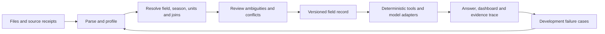

# Real field data, ingestion, and benchmark research

Status: source research and sample inspection completed; proposed addition, not an activated runtime corpus or benchmark. Independent plan review is recorded below.
Research date: 2026-09-27 UTC. Repository reference: `7c502d8` on `main`.

## Working state

- Goal: discover downloadable Canadian and U.S. field datasets, preserve source-specific rights, and design a user-upload ingestion and field-question benchmark linked to the production trace and UI. Assess HLS and local Earth-observation models on an M4/16 GB.
- Context index: `README.md`, `ARCHITECTURE.md`, `data/README.md`, server/package READMEs, active model/RAG profiles, field-state and ingestion services, benchmark contracts. Prior memory is an index only; current code controls findings.
- Constraints: preserve historical evaluation receipts and the unrelated untracked UI redesign plan; no runtime activation, training, model downloads, or bulk imagery acquisition during this research. Distinguish observations, model products, and interpretation. Dataset availability is not a license grant. Evaluation fields and answers must remain outside training and runtime retrieval.
- Evidence required: primary source landing page, geography, spatial/temporal unit, modality, format/access route, license evidence and uncertainty, actual sample inspection where feasible; current code pointers for integration; publisher model claims kept separate from local measurements.
- Unknowns: number of independent usable fields after joins/deduplication; Canadian coverage; exact rights for portal records; model MPS support and end-to-end memory/latency.
- Dependencies: public source availability, manageable sample downloads, source-specific metadata, exact inference preprocessing.
- Done criteria: source inventory, inspected sample receipts, staged ingestion/benchmark/imagery plan, representative field questions, partition and scoring controls, explicit unresolved rights and runtime limits.

## Resource and checkpoint record

Planning envelope: owner plus three bounded researchers (Canada, U.S., imagery/models), approximately 20–40 minutes of wall time with one independent acceptance review. Aim for 30–50 distinct source families/records, primary-source verification on the priority cohort, and a few small real-data samples. Each researcher may retrieve at most 10 MiB of sample data; no paid compute or bulk downloads. Model billing is not exposed, so no dollar estimate is asserted. Reassess after source discovery; stop expanding the long tail when it crowds out licensing, actual file inspection, or the integrated plan.

Research artifacts will live under `docs/reviews/artifacts/field-data-20260927/`. Raw download bytes are research-only under ignored `data/raw/field_data_research/20260927/`; they are not runtime inputs.

## Recommended direction

Build a **field evidence workbench**: raw user files become a reviewable, versioned field record; deterministic tools compute over that record; the agent explains results with source coordinates; the same upload bundle drives UI fixtures and production-path regression traces. Add remote-sensing observations as one modality of this record. Fit predictive models only after field identity, labels, temporal cutoffs, and evaluation splits are reliable.

More data is useful when it adds independent farms/sites, crops, seasons, measurement methods, or file formats. Millions of pixels, sensor readings, or replicated plots from one research site do not establish broad field generalization. Maintain separate inventories of source records, source families, sites/farms, fields, plots, field-seasons, samples, and observations.

The acquisition portfolio should have four explicitly different roles:

1. **Field/plot observations:** measured soil, crop, management, weather, yield, scouting, or hydrology tied to known experimental or operational units.
2. **Spatial context:** official boundaries, soil maps, weather grids, crop classifications, and satellite reflectance. Useful joins; neither land tenure nor a lab measurement is inferred from them.
3. **Model products:** interpolated soil properties, satellite yield maps, forecasts, gap-filled series, embeddings, and simulations. Useful inputs or comparison arms; never silently promoted to observed labels.
4. **Documents:** methods, lab reports, field books, treatment layouts, and extension trial reports. These explain units, treatments, and limitations; paper conclusions are not automatically correct answers for another field.

## What was found and actually acquired

The discovery catalogs contain **51 entries across 50 distinct landing-page URLs**: 23 Canadian entries, 23 U.S. entries, and five supplementary aggregate/model/boundary datasets. DRIVES appears in both national views. There are **28 entries with an identified open license, 14 conditional, and nine with unresolved rights**. These are evidence-status counts, not legal admission decisions; a listed license can still have attribution, scope, or file-specific requirements. Shared experiments, mirrors, versions, and overlapping field populations have not been fully deduplicated. The imagery ledger adds 37 product/model/access references, not 37 more field datasets.

- [Canadian catalog](artifacts/field-data-20260927/canada-sources.json) and [Canadian findings](artifacts/field-data-20260927/canada-notes.md).
- [U.S. catalog](artifacts/field-data-20260927/us-sources.json) and [U.S. findings](artifacts/field-data-20260927/us-notes.md).
- [Context/model-output catalog](artifacts/field-data-20260927/context-sources.json).
- [Combined sortable CSV](artifacts/field-data-20260927/source-catalog.csv) and [inventory counts](artifacts/field-data-20260927/inventory-summary.json).
- [Imagery/model assessment](artifacts/field-data-20260927/imagery-models.md) and [primary-source ledger](artifacts/field-data-20260927/imagery-sources.json).
- [Grounded development question seeds](artifacts/field-data-20260927/sample-question-seeds.json); numerical facts inspected, agronomic interpretation review pending.

### Priority acquisition shortlist

| Source | Real content and useful scale | Rights/access found | Suggested role |
|---|---|---|---|
| [Midwest corn stalk nitrate](https://agdatacommons.nal.usda.gov/articles/dataset/Data_from_Late-season_corn_stalk_nitrate_measurements_across_the_US_Midwest_from_2006_to_2018/24668283) | 10,675 field IDs; 32,025 measurements, 2006–2018; N management and tissue tests | CC BY 4.0; principal CSV and dictionary downloaded | Broad field-specific QA and missing-evidence tests; no yield labels; privacy-generalized locations prevent exact imagery joins |
| [Akron dryland spatial yield](https://agdatacommons.nal.usda.gov/articles/dataset/Data_from_Topographic_position_index_predicts_within-field_yield_variation_in_a_dryland_cereal_production_system/28914434) | 721 inspected rows, 21 columns; yield extracted at soil locations, crop/year, N, topography, weather | CC0; two files downloaded | Spatial table import and yield QA; 18 management units do not mean 18 independent farms |
| [Midwest N-response trials](https://datadryad.org/dataset/doi:10.5061/dryad.66t1g1k2g) | 49 site-years, eight states, 16 N rates, four replicates; XLSX soil, management, weather, yield, plot Shapefiles | Exact DOI DataCite metadata confirms CC0; 11.70 MB file set advertised; browser download attempts returned 403 | Best candidate for linked field bundles and difficult treatment/quality questions; actual file parsing remains pending |
| [Transforming Drainage](https://agdatacommons.nal.usda.gov/articles/dataset/Transforming_Drainage_Research_Data_USDA-NIFA_Award_No_2015-68007-23193_/24665985) | 39 experiments with management, water, soil, weather and yield tables | CC BY 4.0; file list inspected, bytes not acquired | Rich multimodal trial questions; preserve experiment-specific protocols |
| [Genomes to Fields 2016](https://www.genomes2fields.org/resources/) | Multi-environment maize trials with plot phenotypes, management, soil/weather and genotype | Specific 2016 ADC record cataloged as U.S. Public Domain; linked download route not exercised | Scale crop/season diversity; plot, genotype and site effects require explicit grouping |
| [Morrow Plots v2](https://databank.illinois.edu/datasets/IDB-3676612) | Long treatment/planting/yield history from one Illinois site | Source index reports CC BY; direct fetch 403; exact license version/file bytes still to verify | Longitudinal record and method-change QA; one site is not broad independent replication |
| [Bowles long-term rotations](https://datadryad.org/dataset/doi:10.6078/D1H409) | Plot/block maize yields from 11 North American trials, including Canadian coverage | Exact DOI metadata confirms CC0; 567 KB CSV advertised, not downloaded | Canadian/U.S. observed yield lead; inspect site codes and overlap with DRIVES before splits |
| [Swift Current tillage/watershed study](https://open.canada.ca/data/en/dataset/b22cd297-cdb4-4d76-9f79-cc1c16d0e9e7) | Saskatchewan measured soil/hydrology; study 1962–2011; sampled nutrient table 1970–1992 | Open Government Licence – Canada; two small CSVs downloaded | Canadian soil/depth/date ingestion and context questions; no yield in listed resources |
| [AAFC Annual Crop Inventory ground truth](https://open.canada.ca/data/en/dataset/503a3113-e435-49f4-850c-d70056788632) | Ground-truth crop labels and geospatial records | Open Government Licence – Canada; download directories discovered, files not inspected | Crop identity and geometry lane; not measured yield or management history |
| [UBC Farm](https://borealisdata.ca/dataverse/UBC_CSFS) | Eight related datasets: field map, cover crops, seeding/transplants, amendments, IPM and pests | Individual APIs report CC BY-NC-SA 4.0; two files downloaded for local research | Excellent realistic upload design corpus; keep a separate noncommercial lane and preserve ShareAlike/attribution terms |
| [SMAPVEX16 Manitoba](https://nsidc.org/data/sv16m_csm/versions/1) | Five related measured soil moisture/vegetation/texture products; RISMA station context | Earthdata login; source-specific reuse terms unresolved in this pass | Spatial/temporal joining, remote-sensing calibration and point-vs-field questions; no acquired bytes |
| [DRIVES](https://catalog.data.gov/dataset/diverse-rotations-improve-valuable-ecosystem-services-drives-database) | Long-term rotations including Elora/Ridgetown; rich measurement tables behind request | Only public site metadata downloaded; substantive Canadian tables require extra forms/acknowledgements | High-value access-request queue; not an already available open field corpus |

The catalogs also retain Bushland crop-specific growth/yield studies, Colorado sunflower water use, South Dakota rotations, GRACEnet/REAP/NUOnet records, switchgrass trials, multistate maize imagery, KBS experiments, Magruder and OFPEDATA. Some are immediate acquisition candidates; others are retained precisely because license or access remains unresolved. University/extension reports can be valuable document fixtures, but this pass did not establish a broad redistributable Canadian commercial-field yield corpus.

Two negative findings matter. [CropNet](https://huggingface.co/datasets/CropNet/CropNet#license) has contradictory license metadata and restrictive terms in its own card, and its target is county yield. Keep it on hold. A SAFE-Hub search lead contained placeholder DOI strings; it was excluded from real dataset counts. These are reasons to preserve evidence of rejected leads, rather than count every search hit.

### Actual sample inspection and what it teaches

**Ten data/dictionary/metadata-table files from seven records, 7,534,085 bytes total**, were downloaded and inspected. API metadata snapshots are additional small receipts. Raw bytes remain under ignored `data/raw/field_data_research/20260927/`; no source data were admitted to runtime, training, or a published benchmark. Restricted/noncommercial raw files are not in the public package.

| Inspected file family | Observed result | Design consequence |
|---|---|---|
| Corn nitrate survey and dictionary | 32,025 rows; 10,675 field IDs; three samples per field. First field repeats the same 131.04 kg N/ha across its three rows. | Group measurement rows before totaling operations; blindly summing gives a false 393.12 kg/ha. Dictionary and table names differ for the nitrate variable; preserve an explicit alias mapping. |
| Akron yield and dictionary | 721 rows; UTM 13N coordinates. Wheat/corn/millet use different moisture conventions. | CRS and moisture basis belong in the record, not inferred prompt prose. Yield at sampled locations is not area-weighted whole-field yield. |
| UBC cover crops and seed/transplants | 449×21 and 2,233×27 tables; `.tab` files are comma-delimited; planned and completed actions differ; a note explicitly questions a field-map placement. | Sniff formats, preserve completion status, and carry uncertain joins. Filename extensions and plausible dates are not validation. |
| Swift Current metadata and nutrients | 5×4 and 93×11 tables; Latin-1 required despite UTF-8 portal metadata; two-digit years, depth codes and units need a dictionary. | Retain encoding and unresolved semantics. Typical management descriptions cannot become dated operations. |
| DRIVES site metadata | 22 rows and 29 columns; includes Elora/Ridgetown. | A site inventory is not an acquired observation dataset. |
| [Weak-supervision county CSV](https://zenodo.org/records/7751191) | 45,499 rows but only county ID, year and yield columns. | A large table can still have weak field relevance; surrounding crop/unit metadata are necessary. Useful negative-scope fixture. |

For example, an actual medium case asks why three nitrate-survey rows must not triple the N rate. A hard case asks why a county centroid cannot locate that field for satellite clipping. An expert case asks whether tissue samples without yield or a comparison treatment establish yield response; the correct answer is that the causal claim is not identifiable. Eight machine-readable U.S. seeds and four Canadian draft questions show how source structure produces meaningful tests. They are exposed development material, not a sealed evaluation.

## Current implementation and controlling gaps

These are code observations at the recorded reference commit, not end-to-end runtime tests.

| Existing boundary | Observed behavior | Proposed addition |
|---|---|---|
| `server/schemas.py::FieldContextCreate` | Crop, year, geography, notes, constraints, metadata | Versioned identities for farm/site, field, boundary, zone, plot, treatment, crop season; keep a plot distinct from its containing field |
| `FieldEventCreate`, `field_events.py` | Observation/sample/operation/decision/outcome/note/correction; append-oriented hash chain and correction references | Deterministic import transactions with original file/row lineage, idempotent retries, supersession, and atomic rollback |
| `field_measurements.py` | Typed `field_measurement.v1` currently validates only `soil_test`; preserves method/depth/units/scope | Additional typed observations for yield, moisture, weather, phenology, scouting, and imagery; missing, censored, not sampled, and not applicable must differ |
| `AttachmentCreate` and `app.py::_attachment_content_and_metadata` | Text/Markdown/JSON/PDF/JPEG/PNG/WebP accepted; CSV/XLSX/geospatial MIME types absent; PDF path is labelled a local text stub; image observation is a stub | Format-aware parsers and extraction QA; scanned-table OCR as an explicit, reviewable inference step |
| `services/datasource_service.py` | Reads local CSV/TSV/JSON as UTF-8 text and chunks by character count | Schema-aware tables, exact cell locators, foreign keys, units, QA flags, and deterministic aggregation; chunking alone loses table semantics |
| `chat_service.py::_with_stored_field_history` | Includes at most 12 recent events and 480-character summaries, plus a typed soil measurement | Question-bound retrieval over the complete admitted field record, with receipts for selected and omitted observations; test older decisive evidence explicitly |
| `field_context_compiler.py` | Separates mapped priors and public adapter context | Bounded field-observation aggregates and file/row citations, kept separate from model estimates and interpretations |
| `chat_service.py::execute_agent_request`, `execution_core.py` | Shared production execution seam and ordered 17-stage receipts | Benchmark runner around the actual upload→store→query→answer path, with ingestion receipts linked to the existing trace |
| `benchmark_rehearsal.py` | Product-core rehearsal is non-claim and supports document/graph retrieval 2×2 only | New scored field benchmark contract; additional ablations require implementation and parity checks, not invented switches |
| Active `configs/model.yaml` | Revision-pinned local MLX Gemma model | Keep language generation separate from numeric prediction and EO inference; budget combined unified memory |

Relevant existing tests: `test_field_measurements.py`, `test_field_events.py`, `test_field_context_compiler.py`, `test_chat_service_field_context.py`, `test_execution_core.py`, and `test_demo_field_library.py`. No claim is made that these tests cover arbitrary data upload or satellite analysis today.

## Ingestion design: load the field from what the user supplies

1. **Receive and preserve.** Hash original bytes; retain filenames, MIME/sniffed format, source DOI/version, license evidence, uploader/workspace, ingestion time, and original encoding. Bound archive expansion and preserve parent/member hashes. Uploaded text is evidence, never agent instructions. No external OCR or hosted inference is implied by an upload.
2. **Profile before mapping.** Detect workbook sheets, header offsets, merged cells, long/wide tables, units embedded in labels, date locale, decimal separators, missing-value codes, PDF pages, geometry CRS, and raster nodata/scale factors. Preserve original values alongside normalized values. Treat ambiguous units/dates as pending.
3. **Resolve identity and spatial support.** Keep publisher IDs and stable internal IDs for site→field→zone/plot→season→sample. Record experimental treatment, replicate/block, crop/cultivar, boundary validity interval, sampling design, and point/footprint geometry. A coordinate rounded for privacy is not a surveyed boundary; a soil sample point is not a field polygon. Cross-file joins need an explicit key and a join-quality receipt.
4. **Normalize through typed adapters.** First CSV/TSV and XLSX; then GeoJSON and zipped Shapefile/GeoPackage; next text PDFs and scanned reports; later yield-monitor/ADAPT exports, GeoTIFF, NetCDF and sensor logs. A parser may suggest a mapping, but deterministic validators decide whether required evidence exists. Rejected rows remain in the import report.
5. **Resolve only material uncertainty with the user.** Show “3 fields found; 2020/2021 seasons; 2 unassigned lab reports” and a compact correction table. Ask for the missing field match, unit, date interpretation, or permission when it changes meaning. Save that decision as provenance. Never fill a missing N rate, sample depth, or yield unit with a plausible default.
6. **Commit an atomic field snapshot.** Append events and typed observations; keep large arrays/tables in content-addressed local artifacts with indexed metadata. Store import status, accepted/rejected counts, every transform/version, corrections, and snapshot hash. Reimporting identical bytes is idempotent. Corrections supersede records without rewriting prior traces.
7. **Query through tools.** Join/filter/aggregate in deterministic code; retrieve only question-relevant evidence to the language model. A 50,000-row yield table does not belong in the prompt. Each derived value carries input IDs, filters, units, weighting, exclusion counts, and function/version.
8. **Project to UI and benchmark.** The field view shows history, data completeness, methods, provenance and conflicts; charts distinguish observation/model/interpretation. Development demo bundles import through the same route as user data. They can reset reproducibly into an isolated workspace.

Minimum cross-modality record contract:

| Group | Required information |
|---|---|
| Identity | `source_dataset_id`, version, `site_id`, optional `field_id`, `plot_id`, `zone_id`, `season_id`, `observation_id`; unknown identifiers remain null |
| Spatial support | Geometry ID/version, CRS, point/zone/plot/field/grid support, area/footprint, privacy generalization; footprint uncertainty |
| Time | `observed_at`, interval, local timezone/precision, crop year, `recorded_at`, `available_at`; both event and knowledge time for replay |
| Value | Variable code, raw value/unit, normalized value/unit, censoring qualifier, method/instrument, depth, moisture basis, detection limit and QA flags |
| Experiment | Treatment/replicate/block, cultivar, planted/harvested area, management history, observational vs randomized design |
| Lineage | Original hash, sheet/table/page/row/column or raster asset/window, parser and transformation versions, source licenses and attribution |
| Meaning | `evidence_role=observation|model_output|interpretation|regional_prior`; confidence cannot change that role |
| Access/use | Workspace authority, sensitivity, public redistribution decision, runtime admission, training eligibility, benchmark split and revocation links |

Use [ICASA's official dictionary](https://github.com/DSSAT/ICASA-Dictionary) for agronomic variable mappings and [AgGateway ADAPT](https://adaptstandard.org/docs/) for operational interchange. ICASA separates experiment metadata, management, soil, weather, and measurements. ADAPT uses JSON with GeoParquet/GeoTIFF. These are adapter targets and vocabulary references, not a reason to discard the original source structure or assume all machine exports conform. Pin the standard version and retain source-specific fields.

## Benchmark design

### Population and sample size

Start with **24 real field/site-season upload bundles from at least 12 independent sites/farms**, with both countries represented where rights and records allow. Aim for 12–20 questions per bundle, roughly 300–500 cases. Include a geometry+yield bundle, lab workbook, management log, weather series, research treatment table, PDF methods, and incomplete/conflicting uploads. Prefer four or more independent source families. These are planning targets, not acquired counts.

For v1, target **300 field/site-seasons from 60–100 independent site/farm groups and 10+ source families**, yielding roughly 3,600–6,000 questions. Require a Canadian stratum with enough independent groups to report separately; do not manufacture balance by counting adjacent plots as farms. If Canadian commercial-field coverage is insufficient, publish that coverage gap and a narrower research-site claim. A large survey with anonymized IDs may support tabular QA while being unsuitable for an imagery join.

Sample across Prairie cereals/oilseeds/pulses, eastern Canadian corn/soybean, U.S. Corn Belt rotations, dryland wheat, and an irrigated stratum. Track climate, soils, conventional/alternative management, season, file format, observation density and missingness. This is a target coverage matrix; the inventory does not yet prove all strata are available.

Unit of inference is the farm/site group, with field-season and questions nested inside it. With 100 independent binary units, a worst-case normal approximation is about ±9.8 percentage points at 95%; with 300 independent units, about ±5.7. Correlated questions do not buy that precision. Use paired group bootstrap intervals, per-stratum results and clustered comparisons; use pilot variance to set the eventual sample size and minimum detectable improvement.

### Three test layers

| Layer | Input to system | What it diagnoses |
|---|---|---|
| Ingestion | Original public files, as a simulated user upload | Extraction, identities, dates/units, joins, missingness, source roles, geometry and source locators |
| Reasoning with reviewed records | Independently checked normalized field snapshot | Tool selection, arithmetic, temporal/spatial reasoning, evidence selection and abstention without parser confounding |
| Full product | Fresh isolated workspace, upload, field selection, question via product path | End-to-end answer, trace and UI parity; includes ingest and capability failures in the denominator |

Use human-reviewed fact tables and deterministic numerical oracles for extraction and calculations. Hard/expert interpretations need a rubric with required evidence, plausible alternatives, unknowns, prohibited claims, and independently reviewed answerability. Freeze the rubric before evaluating models. An LLM judge may triage; it is not the sole authority for correctness. Ground truth can be “not identifiable from these uploads.”

### Field-specific question families

These are **templates**, not answered cases; instantiate only when the cited data exist. Publish exact source cells, temporal cutoff, expected tool inputs, acceptable numeric tolerances and answerability state in a separate evaluator package.

| Level | Example user question | Required behavior / oracle |
|---|---|---|
| Easy | Which crop and cultivar were planted in this field in 2021, and on what date? | Locate matching field-season; preserve ambiguous dates and crop naming |
| Easy | What was the reported nitrate value for sample S, at what depth and with which method? | Correct row, unit, qualifier and depth; exact file/sheet/row citation |
| Easy | Which files contain measured yield, and which contain predicted yield? | Classify evidence role using methods and metadata |
| Easy | Do my uploads contain a usable boundary for this field? | Distinguish polygon, trial layout, point and anonymized location |
| Medium | How much N was applied before July 1, and which applications are included? | Sum nutrient mass, not product mass; preserve unknown composition and cutoff |
| Medium | What is the area-weighted harvested yield after the documented exclusions? | Valid area weights, dry/wet basis, duplicates and excluded passes; independent calculation |
| Medium | Did soil P change between these two reports? | Compare methods/depths/units; refuse unsupported cross-method conversion |
| Medium | How many days had no valid moisture reading in this period? | Distinguish missing, failed QA and observed zero; explicit expected sampling cadence |
| Hard | Which zones repeatedly underperformed, after controlling for crop and valid coverage? | Multi-season joins, crop comparability, spatial weights, missing-area sensitivity |
| Hard | What evidence supports water stress rather than N limitation here? | Separate symptoms from causes; weather, moisture, management and EO timing; preserve rivals |
| Hard | As of June 15, what yield estimate could we have made, with uncertainty? | Use only information available then; no final yield, future composites or fitted-on-test parameters |
| Hard | Does the reported treatment difference survive the trial's block/replicate structure? | Correct experimental unit, uncertainty and missing-plot handling; no pseudoreplication |
| Expert | Can these observational records identify the causal effect of the extra N application? | Identify confounding and design limits; no causal conclusion from correlation alone |
| Expert | What additional evidence would most reduce uncertainty before acting? | Question-bound evidence gaps and discriminating observation plan, not invented diagnoses |
| Expert | Is the apparent satellite anomaly robust to clouds, crop rotation and boundary mixing? | Alternative QA/baselines, valid-pixel denominator, alignment and source version |
| Expert | Would this U.S. trial support a recommendation for this Canadian field? | Scope and transfer limits; trial evidence does not supply Canadian current authority |

Add transformed robustness variants only in the same split as their parent: reordered sheets, alternate date formats, recoverable unit changes, duplicated files, corrected results, OCR errors and source-instruction attacks. They are synthetic perturbations of real data and must be labelled accordingly. Add negative cases with unrelated fields, future observations, stale labels, county averages substituted for field yield, missing boundary, and incompatible soil methods.

### Leakage, training and UI separation

Assign site/farm/source-lineage groups **before** generating questions, embeddings or synthetic variants. Deduplicate DOI versions, mirrored repositories, annual releases, adjacent parcels and common underlying experiments. Freeze train/development/sequestered evaluation groups and enforce all years and derivatives of a physical field together for the unseen-field test. A separate forward-year test may reuse sites with a strict as-of cutoff, but must report that easier generalization target separately. Add leave-one-source-family-out and geographic holdouts where data support them.

Development field bundles may be visible in the UI and used for trace-guided repairs. Sequestered fields, answers and scorer files cannot enter shared retrieval, demo libraries, SFT or repair prompts. At evaluation time the case's uploaded observations can be mounted into a disposable, case-local field store; that is the benchmark input, not general retrieval knowledge. The answer key and rubric never enter the runtime process. The public, already-inspected samples in this research are development-only. New public test data can be held out from our development but cannot be claimed absent from foundation-model pretraining.

Keep three learning activities distinct: (a) deterministic ingestion/tool improvements, (b) supervised crop/EO prediction on measured, split-safe labels, (c) language-model fine-tuning for evidence use and tool behavior. The existing fine-tuning design review and current Canadian source policy retain their training gate; discovery does not change it. Train on separately admitted fields and reviewed responses; do not recycle benchmark traces into SFT. User private uploads and conversations require a separate purpose-specific opt-in and are excluded by default.

### Scoring and diagnosis

Report extraction exactness, missingness/qualifier preservation, join accuracy, geometry validity, unit/method correctness, numeric error within declared tolerance, temporal-cutoff compliance, citation support and completeness, calibrated abstention/clarification, unsupported-action rate, and task completion. Report latency, memory, model calls, context tokens, tool/network bytes, cache hits and cost when observed. An answer held for evidence insufficiency is not the same as a timeout or crash; retain all dispositions.

Trace the first failed boundary: upload→parse→identity/unit mapping→field snapshot→retrieval/aggregation→capability execution→prompt→generation→verification→rendering. Keep input/output hashes and selected/omitted evidence for each new import/tool stage, linked to the production execution ID. Compare raw-file and reviewed-record lanes to attribute ingestion failures rather than blaming the language model. Compare document/graph 2×2 only where the existing adapter supports it; proposed model/no-model or imagery ablations need their own validated contracts.

Preserve deterministic calculator, retrieved-evidence-only, simple statistical predictor, current full agent and candidate full agent baselines. Pair runs on the same field bundles and cutoffs. Improvement is accepted on a frozen development checkpoint with no safety/lineage regression, then checked once on a fresh evaluation cohort. Never rewrite RC1–RC3 or call this addition sealed-v3 validation automatically.

## Imagery, seasonal dashboard and the M4

**HLS is available on AWS, with an access qualification.** The [L30](https://registry.opendata.aws/nasa-hlsl30/) and [S30](https://registry.opendata.aws/nasa-hlss30/) registry records point to protected NASA buckets in `us-west-2`, require Earthdata access, and identify CC BY 4.0. Direct S3 credentials are region-bound; for this Mac, use authenticated HTTPS COG windows or a NASA subset service. This is different from assuming an anonymous AWS bucket. [NASA's access overview](https://hls.gsfc.nasa.gov/data-access-and-tools/) describes the supported routes. An alternative is anonymous [Sentinel-2 L2A COG access through Earth Search](https://registry.opendata.aws/sentinel-2-l2a-cogs/), with Copernicus terms retained. Not every Sentinel/Landsat AWS distribution has the same billing/access conditions.

Discover scenes by actual polygon and time, buffer in metres using a suitable CRS, fetch only required bands/windows, and retain asset IDs, product versions, scale factors, masks, timestamps and transformation hashes. A COG window reads compressed blocks; network bytes can exceed the raw cropped tensor. Cache and measure transfer, decode and inference separately. The model's context buffer must not expand the area used in field statistics.

The first dashboard should show a masked observation with acquisition date, crop/planting provenance, last clear observation, clear-area fraction, index trajectory with visible gaps, weather history and a declared historical comparator. NDVI/EVI or water-sensitive reflectance indices describe spectral behavior; a low value alone does not diagnose N deficiency, pests, or drought. Use a crop/phenology-matched baseline with enough eligible historical observations, and show when it is unavailable. A change in crop, sowing date, clouds or mixed boundary pixels can create a false anomaly. At 30 m, one pixel spans 0.09 ha; a small/narrow field may need Sentinel-2's finer bands or a withheld spatial claim.

Observed hardware: **Apple M4, 16 GiB unified memory**. The current project environment has MLX, NumPy, pandas, GeoPandas and PyArrow, but lacks PyTorch, Rasterio and xarray. No EO inference was run. About 2 GiB free disk was observed during research; recheck it before acquisition. Disk capacity currently argues for small subsets and bounded caches, even if RAM permits inference.

For a square 100 ha field plus a 200 m buffer on each side, the bounding square is 1,400 m wide. A 30 m, six-band, 24-date float32 array is about **1.21 MiB** before masks, warping, padding, weights and activations. A 256×256, 12-band, 24-date array is **72 MiB**. These are transparent input-array calculations, not total model memory measurements. Small crops make local work plausible, but attention buffers, time dimension, preprocessing and the resident language model determine the actual peak.

| Local candidate | Why consider it | Verified limits |
|---|---|---|
| Deterministic indices + regularized/tree-based predictor | Cheap interpretable baseline; no EO backbone necessary for the first useful dashboard | Requires correct QA, joined measured targets, grouped splits and calibrated uncertainty |
| [Prithvi EO 2.0 tiny-TL](https://huggingface.co/ibm-nasa-geospatial/Prithvi-EO-2.0-tiny-TL) | Direct six-band HLS match; advertised small encoder; full checkpoint about 129 MB; Apache-2.0 | Official example chooses CUDA or CPU, not MPS. Local inference/MPS remains untested. It is an encoder, not a ready field-yield model. |
| [Presto](https://github.com/nasaharvest/presto) | Small temporal/pixel encoder; useful frozen-feature baseline | Input modalities/masks/calendar matter. A field-average series is not equivalent to its native pixel inputs. |
| [OlmoEarth v1.2 Nano/Tiny](https://huggingface.co/collections/allenai/olmoearth) | Nano/Tiny checkpoints roughly 17/107 MB; native Sentinel/Landsat temporal features | No “OlmoEarth 3+” in the inspected collection; Olmo 3 is different. CPU examples exist, but M4/MPS not established. Custom [artifact license](https://huggingface.co/allenai/OlmoEarth-v1_2-Nano/blob/main/LICENSE.txt) includes restrictions; it is not Apache/MIT. |
| [AlphaEarth annual embeddings](https://developers.google.com/earth-engine/guides/aef_on_gcs_readme) | Download precomputed annual feature crops; no local backbone inference | Annual summaries are unsuitable as live in-season observations; using the target year's full-year features leaks future information. Availability must be checked against actual assets. |

Native Sentinel-2 OlmoEarth preprocessing is not interchangeable with HLS just because both are satellite reflectance. Prithvi is the more direct HLS trial. Run models in a separate pinned environment at batch 1, CPU float32 first, then explicit MPS with numerical parity, cold/warm latency and peak-memory receipts. Begin with the language model unloaded; test co-residence afterward. Proposed smoke-test stop limits are 120 seconds per forward or 8 GiB process footprint, sustained memory pressure or accumulating swap. These are experiment bounds, not expected performance.

For yield, compare crop/region/history and weather/index baselines against **frozen embeddings plus a small supervised head**. Use measured harvest outcomes, harvested area and a declared moisture convention. Freeze forecasts at several dates and filter by both observation time and data-availability time. Score unseen farms/sites and future seasons; keep crop/region MAE, bias and interval coverage visible. Crop models such as DSSAT/APSIM can become additional adapters only with adequate cultivar/soil/management inputs, documented calibration, and model-specific terms; simulate scenarios as model outputs. The agent orchestrates validated calculations and explains evidence—it does not turn a foundation embedding into agronomic authority.

The detailed [imagery assessment](artifacts/field-data-20260927/imagery-models.md) retains access differences, model/license comparisons, exact shape assumptions, memory arithmetic, and the proposed device matrix. Local performance, range-read behavior and useful prediction skill all remain unmeasured.

## Rights ledger and source maintenance

Every acquired file needs an immutable source/version identifier, retrieval date, raw SHA-256, publisher checksum where available, license URL/text or metadata snapshot hash, attribution, exceptions and third-party exclusions. Track permission/decision independently for **local research, parsing, runtime use, public raw redistribution, public derivatives, training and resulting model distribution**. A confirmed open-license label in this discovery inventory is not the project's final training or runtime admission. Unknown stays unknown. Preserve UBC's noncommercial/ShareAlike lane, CropNet's conflicting terms, and DRIVES' access conditions rather than making them disappear from the search record.

The public repository should contain discovery metadata, parsers, schemas, question templates and appropriately licensed small fixtures, with explicit notices. Larger data should use source-pinned download manifests and an external/local content-addressed store. Raw licensed data retain their own terms; the repository's Apache-2.0 does not relicense them. A pruning decision can exclude an artifact from future builds while retaining its source/rights/exclusion receipt. No messages to data owners or access requests were sent during this research.

## Staged delivery and acceptance gates

| Stage | Concrete deliverable | Completion evidence |
|---|---|---|
| 0: discovery (this work) | Source/license/access ledger, inspected files, architecture/benchmark plan | Primary-source links; actual download hashes and inspection counts distinguished from advertised counts |
| 1: pilot acquisition | 24 diverse bundles, source-specific rights snapshot and exact artifact manifest | Every byte has a parent source; each field/site unit and missing modality documented; no unknown-license redistribution |
| 2: table and field import | CSV/TSV/XLSX + geometry import, reviewed mappings, versioned field records | Idempotent/atomic import, no silent row loss or unit inference, exact cell lineage, corrections preserved |
| 3: product benchmark | 300–500 reviewed development questions, three layers, isolated workspaces and trace explorer | Deterministic numeric oracles; human interpretation review; stable failure taxonomy; product upload/query parity |
| 4: imagery dashboard | Historical replay for 10 geometry-qualified fields; HLS/Sentinel chips, QA and seasonal charts | Correct band scaling/masks, boundary-area handling, as-of replay, baseline quality and measured local resource use |
| 5: model value experiment | Simple tabular/index baseline vs frozen EO embeddings + small prediction head | Grouped held-out results, uncertainty/coverage, crop/region transfer checks and actual M4 measurements |
| 6: scale and training | 300 field/site-seasons; separate approved training release and untouched final cohort | Rights and split audit, frozen provenance, independent review; no benchmark contamination or unsupported domain claims |

The smallest useful next implementation is stage 1+2 for a few verified sources, followed immediately by exact field questions. Do not begin by building a universal parser or fine-tuning a large model. Stop expanding acquisition when new sources repeat existing modalities but rights, field identity or joins remain unresolved. Source changes invalidate dependent receipts and require explicit revalidation.

## Verification and remaining decisions

Research completion evidence: primary-source discovery across 113 recorded queries; ten small files inspected with hashes/counts; current field/ingestion/trace code and active profiles inspected; M4/16 GiB confirmed; eight concrete question seeds calculated from actual U.S. CSVs and four Canadian drafts grounded in inspected management records. [Search activation](artifacts/field-data-20260927/search-activation.json) preserves the exact public queries. The source catalogs preserve failed fetches and unverified rights.

Final deterministic artifact checks, public-package verification and independent review are recorded in the accompanying review/verification artifacts. This work does not run the agent on the new samples, validate the full test suite, create a scored benchmark, ingest demo fields into the UI, train a model, download model weights, or establish a Mac EO performance result. The planned full verification ladder applies when runtime behavior is implemented.

Remaining decisions are source-specific acquisition order and rights admission, Canadian field-yield coverage, physical-site deduplication, reviewed answer rubrics, and a bounded local imagery experiment. The immediate candidate cohort is Akron, the corn nitrate survey, Swift Current, the CC0 rotation synthesis, the N-response trial bundle and Transforming Drainage; UBC remains a separate noncommercial research lane. This is a feasible ingestion/benchmark program, with field-level yield prediction still a hypothesis to test.

Changed | Research plan, source/query/license catalogs, sample receipts and development question seeds; public package includes only explicit research artifacts.

Verified | Source and sample evidence above; exact final artifact checks are in `verification.json`.

Residual Risk | License/access holds, incomplete Canadian yield coverage, dependent samples, unreviewed expert answers, and unmeasured model/runtime behavior.

Memory Delta | None. Historical memory was used only as an index; implementation conclusions were checked against the current repository.
