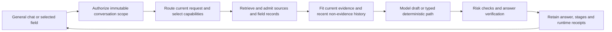

# Portable agronomy: combined runtime and harness diagnostic

Status: both diagnostic runs complete; independently accepted for engineering merge.
The corpus METHOD candidate and prompt KV cache remain disabled in the active
profile. This report does not establish an agronomic improvement or a release.

## What changed for a customer

A customer can start a general chat without choosing a field, or select a saved
field and start/reopen one of its conversations. A conversation keeps its original
scope. The server reauthorizes a field for every request and reloads its current
records. Full transcripts remain stored; the model sees a bounded recent window.
The history block instructs the model to prefer later corrections over earlier
reports, and earlier assistant text is never admitted as source evidence. The request indicator shows retained input usage, the output
reserve, omitted history and measured decoding speed, with explicit unknowns.

History currently enters after routing/retrieval. A follow-up can therefore reach
the model with prior context while the retrieval query still sees only the current
message. This implementation does not provide conversational query rewriting,
a learned agronomy memory, or a model-directed source-search loop.

## Frozen comparison and identities

Each model receives 44 units: 24 active/METHOD product questions on the 12 exposed
PFMH3 cases; 12 fixed minimal-prompt direct references; four three-turn correction
sequences; two two-turn long-context sequences; and two disabled/cold/warm cache
probes using identical retained product prompts. This is 54 turns per completed
model, with extra direct generator invocations inside cache probes.

The output ceiling is 320 tokens, the editor ceiling 220, and the inclusive
operating budget 8,192. Each editor uses the same pinned model as its draft.
Private overlays are disabled. The direct reference changes retrieval,
instructions, interventions and history together; it is a bundled comparison,
not a causal stage ablation or a supported customer mode. The cohort was already
exposed, so no sealed-holdout or population-level claim is available.

| Condition | Model snapshot | Source | Prefill chunk |
|---|---|---|---:|
| Gemma v3 | Gemma 4 E2B 4-bit, `238767527555cb75a05732a84dff5d6ba0dd6809` | `7b41a189298251e0f61bc977c3f6758d67150ee6` | 2,048 |
| Qwen v4 | Qwen3.5 27B 4-bit, `45797d2985a12c55e6473686e9ea91b95e959553` | `1aa7d137bc0d503c706f3f4dabbb5f9b6292b21e` | 512 |

The Qwen resource condition differs because its original 2,048-token prefill ran
out of memory. Context/output allowances, question set and all arms remain fixed.
The source Python tree is unchanged between these two commits. The full manifests,
raw ledgers, stage text, grading packets and hashes accompany this record.
A later diagnostic-only repair at `c90e81dae28390d471e5db64b537094ca551b899`
separates failed-editor final eligibility from a usable draft. Raw run records
retain their original classifier; a separate hashed reconciliation audits every
retained verification receipt before analysis.

## Answer quality

Two independent automated graders receive anonymous answer text and the frozen
per-question rubric. Model, profile and draft/final labels are concealed; identical
answer text for the same question is graded once and mapped to every occurrence.
Across four batches, 84 unique answers map to 168 stage occurrences. The graders
share 38 answers and initially agree on 37 grades. After independent source
adjudication of the one disagreement, agreement is 38/38. This is internal
agreement, not calibrated agronomist validation. Original judgments are retained
alongside source-adjudicated judgments. Ambiguous wording retains explicit unsafe
sensitivity interpretations rather than silently resolving unknowns.

The table uses source-adjudicated primary grades; original primary counts are
also preserved in the evidence. One Qwen direct-reference answer changes from partial to unsafe after the
independent grader checks its materially incorrect Minnesota governing-authority
claim. Its original counts were 0 complete / 10 partial / 2 unsafe.

| Model | Condition | Complete | Partial | Graded unsafe | Denominator |
|---|---|---:|---:|---:|---:|
| Gemma | Active | 0 | 11 | 1 | 12 |
| Gemma | METHOD candidate | 0 | 10 | 2 | 12 |
| Gemma | Minimal direct reference | 0 | 9 | 3 | 12 |
| Qwen | Active | 0 | 12 | 0 | 12 |
| Qwen | METHOD candidate | 0 | 12 | 0 | 12 |
| Qwen | Minimal direct reference | 0 | 9 | 3 | 12 |

Gemma reached the 320-token ceiling on 11/12 direct-reference answers and Qwen on
12/12. Qwen also reached it on 16/22 generated main product drafts, compared
with Gemma on 1/22. Visible
incompleteness remains a failure to finish this task under this budget; it is not
proof that the model cannot answer with another output allowance. METHOD rows
were packed on all seven intended questions and none of the five controls, yet
this did not produce a complete-answer gain. Delivery is not correct selection:
a post-hoc exact-family check matches only five of seven. The balance-sheet
question receives cash-flow context, and the cash-plan question receives enterprise-
budget context. The keyword method selector requests those families; both models
receive the same mismatches. This is a retrieval/planning defect in the non-active
candidate, preserved without tuning against the exposed cases. Gemma's METHOD
partial-budget answer introduced
an unsafe result relative to active. Active and METHOD share an unsafe tree-mulch
answer. The active harness reduced the count graded unsafe relative to the direct
reference, so wholesale harness removal is not supported by this small-model result.

The harness changed 9/12 active drafts and 8/12 METHOD drafts. No complete Gemma
draft was lost or created under the strict rubric. One unsafe METHOD cash-flow
draft became partial after intervention. These are paired stage observations,
not proof that every edit is useful or that retrieval caused an outcome.

Both Qwen product arms end with 12 partial answers. Each has one complete draft
(the same tree-mulch control) that becomes a generic refusal. The verifier flags
a generic depth range, the word “rot,” and a clipped generation; the fallback
clears those checks while removing the requested explanation. Each arm also
removes one draft graded unsafe: the active partial-budget answer and the METHOD
thermal-time answer. Thus the observed intervention trades away both incorrect
and correct substance. Unnecessary-refusal flags occur in six active and five
METHOD answers under the frozen rubric. This supports a targeted intervention
experiment, not automatic removal of the existing protections.

The ambiguous tree-mound endorsement conflicts with
[UMN mulching guidance](https://extension.umn.edu/garden-and-home/yard-and-garden/gardening-in-minnesota/mulching-for-soil-and-garden-health).
Other adjudication checks use
[UMN manure analysis](https://extension.umn.edu/agriculture/animals-and-livestock/livestock-operations/manure-sampling-and-nutrient-analysis),
[UMN forage analysis terminology](https://extension.umn.edu/agriculture/crop-production/forages/measuring-forage-quality),
and [NCHFP blanching guidance](https://nchfp.uga.edu/how/freeze/freeze-generalinformation/blanching-vegetables/).
Additional checks use the [NCHFP bean schedules](https://nchfp.uga.edu/how/freeze/vegetable/freezing-beans-lima-butter-or-pinto/),
[Ontario soil-testing guidance](https://www.ontario.ca/page/soil-sampling-and-analysis-managing-crop-nutrients)
and [Iowa State cash-versus-profit distinctions](https://www.extension.iastate.edu/agdm/wholefarm/html/c3-14.html).
The Minnesota authority check confirms that the cited Chapter 7030 concerns
[noise classification](https://www.revisor.mn.gov/rules/7030.0050/); the relevant
[manure-application rule is 7020.2225](https://www.revisor.mn.gov/rules/7020.2225/).
The asserted Act name remains unverified; absence was not inferred from search.
These checks address specific statements, not complete-answer validity.

## Runtime and multi-turn observations

The Colab device is an NVIDIA L4 with 23,034 MiB VRAM, driver 580.82.07, CUDA toolkit
12.8, Python 3.13.15, MLX 0.32.2 and mlx-lm 0.31.3. This is CUDA execution, not a
Metal performance measurement. Cells run in fresh processes for failure isolation;
their wall time includes imports/model loading and is not a resident app latency.

Both models completed 44/44 units and 54 turns. Gemma's driver took 889.014 seconds;
Qwen's took 3,584.619 seconds. Across both runs, all 84 product turns retain their
quality eligibility under the corrected classifier: zero draft/editor backend
errors, zero eligibility changes and zero context-budget arithmetic violations.

| CUDA isolated-process measure | Gemma | Qwen |
|---|---:|---:|
| Median main product unit wall time, 24 units | 19.532 s | 77.365 s |
| Median measured draft decoding, 22 generated main product units | 99.351 tokens/s | 12.704 tokens/s |
| Median minimal direct-reference unit wall time, 12 units | 18.395 s | 48.098 s |

These are different model/resource conditions and cold unit timings, not an app
speed comparison. The task consumed an observed 3.24 Colab compute units including
setup and failed attempts. The session was stopped; the CLI reported zero active
assignments and a zero compute rate. Controller/worker model billing is unknown.

For Gemma, all 24 main product rows are quality
eligible: 22 generated drafts and two deterministic paths. Its correction sequence
included one and then two prior turns. Nevertheless, a pre-existing numeric-risk
rule withheld supplied-input seed-mass arithmetic. In the long-context sequence,
the first 5,592-token prompt fit; its follow-up omitted the indivisible prior turn
because it exceeded the 2,048-token history window. The fallback to a short current
question did not reliably preserve a useful answer. A truthful omission receipt
helps the user understand this limit but does not itself recover the omitted facts.

All four cache probes (two per model) report a prepared prefix followed by
saved-prefix reuse. Cold and warm cached answers match each other; uncached
answers differ. Exact parity fails in all four probes. Independent source inspection found no reproduced
cache offset or shared-state defect. Different prefill partitioning is a plausible
numerical explanation, not an established cause. Cache activation and speed
claims remain unqualified. The active profile stays off.

Qwen's active correction sequence also includes one and then two prior turns,
yet all three rate-calculation responses withhold the requested method. The
authority sequence retains uncertainty about identification and labels. Its
5,548-token long prompt fits; the follow-up correctly reports missing field
evidence despite omitting the oversized prior turn. This one self-contained
correction does not establish recovery of arbitrary omitted facts.

Qwen's original product prompts at 1,930 and 1,803 tokens exhausted CUDA memory
with prefill 2,048 despite passing a tiny loader preflight. The backend failures
are retained and excluded from quality denominators. A separate fit probe with
prefill 512 generated 320 tokens from the retained 5,548-token long product prompt,
reporting 18,005,080,104 peak allocation bytes and 86.099 seconds including load.
This supports that prompt/resource condition, not the full 8,192-token envelope.
The 16 GiB laptop is unqualified for this profile; the observed peak allocation
already exceeds its total memory.

## Preserved failed attempts and engineering gates

The first remote capsule omitted a required 108 KB public source registry. It
recorded nine completed and six failed executor units before interruption. A
copied-capsule mock check found the narrow missing dependency and verified all
30 product units after repair. The second attempt exposed incomplete model
snapshots: the owner had omitted two repository metadata files, while the current
Hub client checks the offline tree. The supported project downloader already
fetches full snapshots. That attempt recorded 30 completed executor units and
one failed unit, but its model-quality evidence is invalid. Neither attempt is
laundered into the successful denominator.

The runner now preflights the exact product loader in a killable GPU child and
separates model generation, backend fallback and deterministic bypass from executor
completion. A successfully generated draft followed by an editor backend error
remains draft-eligible while its final product answer is ineligible; intentional
content rejection is a different condition. Interrupted attempts retain their
own directories. Scope repairs cover
both current chat and retained streaming APIs; replay reauthorizes its field,
keeps overrides ephemeral, excludes replay outputs from ordinary history and
resolves repeated replay back to the original history cutoff.

Observed gates at the frozen implementation: 1,436 Python tests passed, four
skipped; 366 frontend tests, typecheck and production build passed; public docs
and strict MkDocs passed; CI including the macOS app smoke test passed. The Qwen
configuration delta passed 19 affected tests and the public package builder.
After the diagnostic-only editor-failure repair, 14 focused tests passed and CI
passed 1,438 Python tests with four skips, frontend, docs, and macOS app smoke
at `c90e81dae28390d471e5db64b537094ca551b899`.
Earlier live layout inspection covered 1,280 px desktop and 390 px mobile widths.
The final live interaction repeat was unavailable: browser inventory was empty
and native app selection stalled. Automated frontend checks passed, but final
live hover, focus, Escape and mobile behavior were not re-observed. This remains
an explicit validation limit rather than a claimed visual pass.

The [independent acceptance review](artifacts/portable-agronomy-20260928/independent-review.md)
accepts the engineering merge with the scientific and live-UI limits retained.
The final public-package build and exact-source CI govern integration.
No agronomic policy or cache activation follows from engineering checks.

## Next experiment before changing the active answer policy

The leading design proposal is to separate transferable reasoning from local
permission to act. Asking how to multiply a supplied rate by area should not
require authorizing that rate. A model should retain correct explanatory content
while claim-specific checks hold unsupported prescriptions. METHOD delivery alone
cannot establish that synthesis works.

Freeze a fresh source-distinct packet and compare matched retained drafts with
and without each intervention, rather than another bundle of prompt changes.
Include a minimal reference, governed retrieval, oracle-source context, and a
claim-level intervention condition; vary one factor at a time. Measure correct
content lost, unsupported action prevented/introduced, task completion and units.
Include output-budget curves so verbosity and truncation are not mistaken for
knowledge deficits. Require zero new material unsafe outputs before activation.

For continuity, test a compact, correction-aware ledger of user-reported facts
against the current recent-turn window. Keep reports, source observations and
model output distinct, and test retrieval/query planning as well as final-prompt
retention. For infrastructure, qualify full prompt envelopes and memory peaks
per pinned backend, then test cache fidelity and resident serving latency. These
are proposed experiments, not features or proven gains in this merge.

A reusable evaluation should distinguish the following rival explanations rather
than encode model-size assumptions in the router:

| Hypothesis | Matched comparison | Observation that would weaken it |
|---|---|---|
| Broad intervention discards useful reasoning | Replay the same retained draft through existing versus claim-specific checks, with the same evidence and output allowance | No recovered correct content, or new unsupported actions |
| Retrieval limits synthesis | Substitute reviewed oracle evidence for retrieved evidence while holding generation and intervention fixed | Answers remain incomplete despite sufficient evidence |
| Short output budgets obscure competence | Repeat fixed questions/configurations over a frozen output-budget curve; report completion and actual tokens | More tokens add verbosity without required substance |
| Follow-ups need explicit corrected facts | Compare recent-turn history with a typed user-report ledger, including routing/retrieval as well as drafting | Corrections remain wrong or reports leak into source authority |
| Runtime settings limit model portability | Qualify pinned model/backend pairs over prompt lengths, prefill chunks and memory caps; separately measure resident requests | Availability or fidelity fails at the advertised operating boundary |

For all conditions, preserve the same source-distinct case assignment, record
backend unavailability outside quality denominators, and keep a complete-product
view alongside draft-stage scores. Include safety controls and straightforward
benign questions so a system cannot improve merely by refusing. A candidate must
recover useful content without introducing a new material unsafe answer before
it can be considered for activation; a small exploratory pass is insufficient.

The proposed infrastructure contract should expose a qualified operating limit,
token-count basis, output reserve, measured memory envelope, cache support status
and backend timings for each pinned runtime. Harness components can consume that
contract without classifying a model as “small” or “large.” Model capacity does
not confer local agronomic authority, and missing source authority does not by
itself invalidate a calculation explicitly limited to supplied hypothetical
inputs. Those distinctions should be tested as claim types and interfaces, with
the existing safety controls retained until a replacement clears its gates.

## Reproducible evidence

The [public run-manifest projection](artifacts/experiment-raw-archive-20260928/run-manifests-public.json)
retains source, configuration, run and unit identities and hashes. The [raw
archive catalog](artifacts/experiment-raw-archive-20260928/catalog.json) binds
the original Gemma and Qwen ledgers, exact run manifests, semantic grades,
failed attempts and runtime analysis by source commit, SHA-256 and byte count.
Those answer-rich files require the separately verified private restore for
exact replay; the current public tree alone cannot reproduce those grades.
[eligibility reconciliation](artifacts/portable-agronomy-20260928/quality-eligibility.json),
[METHOD delivery](artifacts/portable-agronomy-20260928/method-delivery.json),
[engineering checks](artifacts/portable-agronomy-20260928/engineering-validation.json)
and [compute accounting](artifacts/portable-agronomy-20260928/compute-accounting.json)
preserve negative results and distinguish measurements from interpretation.
