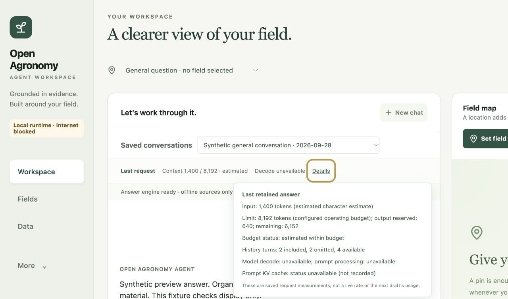

# Portable agronomy residual-risk investigation

Status: bounded investigation completed and [independently accepted](artifacts/portable-residual-20260928/independent-review.md).
No active policy, METHOD or cache activation.
Reference: merged source `3ff64813ce14833f3c819044b96ebda738a60cbe` and the
[completed diagnostic](portable-agronomy-diagnostic-20260928.md). Historical
ledgers, grades and accepted receipts remain unchanged.

## Working state and resource envelope

Goal: discriminate causes of cache output divergence, wrong method-family
selection, loss of correct explanatory content, output-budget confounding,
27B resource limits and the missing final live UI interaction observation.
Evidence is separated into observations, explicit models and interpretations.
Private untracked research and existing stashes are outside this investigation.

Start with source inspection, retained-stage replay and new synthetic contrasts.
Two bounded specialists investigate runtime-cache semantics and method selection;
the owner investigates interventions, orchestrates any GPU work and validates UI.
Estimated whole phase: 45–75 minutes of owner work plus two specialist tasks of
roughly 15–25 minutes each; provider token/cost accounting is unavailable, not
zero. First checkpoint is after source/probe results, before remote provisioning.
If needed, one named L4 session is initially bounded to a 30-minute checkpoint
(about 0.8 CU at the previously observed rate, a planning estimate requiring live
verification). Full suites use Colab; no broad repeat until a distinguishing
experiment is defined. On overrun, reassess the smallest remaining experiment
and preserve partial/failed evidence rather than expand the matrix silently.

## Acceptance map

| Question | Distinguishing evidence | Current boundary |
|---|---|---|
| Cache state bug or prefill numerical divergence? | Compare token/state/logit behavior for identical tokens, matched partitions and cloned versus rebuilt caches | All four retained exact-output probes fail; cache off |
| Method selector overfits wording? | New contrast families that separate a mentioned topic from the requested task; inspect planner/filter interfaces | Delivery 7/7 but family 5/7 on exposed cases; candidate off |
| Verification removes warranted explanation? | Replay retained fixed drafts, isolate rejection causes and preserve numeric/action authority controls | Two complete Qwen drafts lost; broad removal unqualified |
| Output ceiling confounds quality? | Matched prompt/seed/backend with changed output allowance, stage and truncation receipts | Most direct answers hit 320 tokens; no population claim |
| 27B supported on this laptop? | Pinned backend resource envelope and measured device capacity | L4 observed peak exceeds 16 GiB; laptop unqualified |
| Final UI interaction behaves correctly? | Observe hover/focus/Escape and narrow layout using synthetic local data | Automated suite green; prior final live repeat unavailable |

The table records the initial state. Findings below supersede its open questions
only within the measured boundaries.

No result from these exposed or synthetic diagnostics alone promotes a model,
corpus, cache setting or general agronomic competence. Source-distinct validation
and independent review remain required for any later active behavior change.

## Cache result: execution partitioning and a separate repeatability gap

One revision-pinned L4 session ran four retained prompts, each through seven
conditions at a fixed 320-token horizon: uncached, repeated uncached, split direct,
manual split, copied split, cold LRU and warm LRU. It also ran the output-budget
sweep below. MLX 0.32.2 / mlx-lm 0.31.3, Python 3.13.15 and model revisions match
the retained setup. Exact prompts, token IDs, installed-source hashes, all cache
state hashes, offsets, logits, model-file hashes and failures are retained in the
[raw bundle](artifacts/portable-residual-20260928/raw-bundle.json).
These are instrumented causal probes; their timings are not serving benchmarks.

| Model / prompt | First uncached vs split token difference | First uncached vs cold-LRU difference | Main observation |
|---|---:|---:|---|
| Gemma / active | 97 | 23 | Some independent prefix states already differ before insertion |
| Gemma / METHOD | 53 | 53 | Cold/warm continuation also varies from equal saved-prefix receipts |
| Qwen / active | 162 | 162 | Every split/manual/copy/LRU variant agrees exactly |
| Qwen / METHOD | 144 | 144 | Every split/manual/copy/LRU variant agrees exactly |

Indices are zero based. All differences in the two table columns occur before
either sequence's first EOS. The fixed horizon continues past EOS for mechanical
comparison; other late differences must not be interpreted as product outputs.
For example, the Gemma METHOD split-direct/clone difference at index 155 is after
EOS. The [derived comparison receipt](artifacts/portable-residual-20260928/cache-analysis.json)
retains that distinction. All four uncached repeats agree exactly. Every tested
saved LRU prefix remains unchanged, and prefix/fetched states match.

For Qwen, the controlled variants isolate changed prefill partitioning as the
observed execution boundary. They do not distinguish ordinary finite-precision
effects from a partition-sensitive model/kernel defect. No token-offset or
cache-copy defect was observed.

Gemma needs a different qualification. Its apparent active-arm LRU difference
already exists in layer 14's value tensor **before** LRU insertion. A separately
bounded, 25-second follow-up computes three identical prefixes, then interleaves
direct-copy/LRU/direct-copy/LRU continuations from one saved origin. One prefix
repeat changes 1,536 values at token positions 805–807, maximum absolute difference
2.765625; another repeat matches exactly. All four branch inputs and saved states
remain equal. The first direct continuation differs in logits from the later
direct continuation as well as from LRU; the latter three agree. All eight selected
tokens still agree. This reproduces state/logit non-repeatability without requiring
LRU lookup as the cause. Instrumentation, allocation/evaluation order and backend
numerics remain unresolved rivals; this is not a diagnosis of a specific kernel.

The follow-up is preserved in [its receipt](artifacts/portable-residual-20260928/same-origin-gemma-active.json.gz)
and raw arrays in the bundle. It does not certify a long continuation, another
backend or real product serving. Keep prompt caching disabled. The next cache
qualification needs counterbalanced repeats and a trusted numerical reference,
with separate allowance for benign numeric drift and unacceptable decision drift.

## Output allowance: confirmed truncation, no quality promotion

The twelve new calls retain identical question/messages, sampler, seed and backend
and change only the generation allowance within each exposed prompt. All four
320-token baselines exactly reproduce their historical texts. Every shorter text
is a prefix of the next allowance's text.

| Model / stage | 320 allowance | 640 allowance | 1,024 allowance |
|---|---|---|---|
| Gemma / tree-mulch product draft | EOS at 219 | EOS at 219 | EOS at 219 |
| Gemma / cash-plan direct reference | Length 320 | Length 640 | EOS at 863 |
| Qwen / tree-mulch product draft | Length 320 | EOS at 342 | EOS at 342 |
| Qwen / cash-plan direct reference | Length 320 | Length 640 | Length 1,024 |

The [budget analysis](artifacts/portable-residual-20260928/budget-analysis.json)
therefore confirms that the diagnostic ceiling clipped some answers. Qwen's tree
draft loses its `incomplete_generation` flag at 342 tokens under reconstructed
evidence, but retains numeric-depth and named-condition flags. More output alone
does not clear the verifier boundary. Gemma's tree answer is unchanged and Qwen's
cash-plan reference still does not finish at1,024. This sweep does not run the
editor, score new semantic quality or show that longer outputs are safer/better.
The active draft allowance remains 640, and the historical 320-token study remains
unchanged rather than being silently regraded under new settings.

## Confirmed selection and verification defects

The [METHOD contrasts](artifacts/portable-residual-20260928/method-investigation.md)
separate requested operations from incidental topics, negated requests and mixed
tasks. The unchanged selector exactly matched 19 of 47 authored family sets;
membership precision was 0.50 and recall 0.75. These are stress-set results,
not population estimates. Labels were recorded before this probe, but authored
after the original failures were known. They are not held out.

The defect propagates beyond a keyword counter. Six model-free product-context
checks show the wrong selected family becoming a method obligation, retrieval
query and admitted card. A brochure-author question with background liquidity
wording receives an irrelevant liquidity card and an `ADEQUATE` method slot.
The country applicability gate remains separate: it correctly withholds a card
on an otherwise matched question with unresolved country. The supported set
contains all seven intended families; missing families do not explain the errors.

The [verifier contrasts](artifacts/portable-residual-20260928/verifier-investigation.md)
reproduce failures on both sides of the safety boundary:

* A source recording 120 kg does not trigger review of an answer saying 20 kg.
  The numeric matcher uses substring membership, not quantity identity.
* Given 12 bags at 25 kg each, an incorrect total of 25 kg passes while the
  correct derived total of 300 kg is marked unsupported. Source-number presence
  does not verify a mathematical relation.
* An answer ending `12 × 25 = 300.` is also marked incomplete because its terminal
  `300.` matches the dangling-list-marker heuristic.
* A source-supported negated diagnosis triggers the positive diagnostic-certainty
  rule. Regulated-permission and positive-diagnosis controls still trigger in
  their corresponding fixtures.

Six of twelve authored review labels disagree with `requires_review`, but that
aggregate combines different mechanisms. In particular, the conditional-disease
case triggers missing-content/route checks, not a diagnostic-modality rule;
it is not evidence that the diagnosis regex rejects every conditional statement.
These calls isolate local assessment with explicit fixtures, not end-to-end
product outcomes.

For the retained Qwen tree-mulch draft, current reconstruction matches all five
document IDs and snippet prefixes, and reproduces the recorded assessment exactly.
The original full verifier evidence and document hashes were not retained, so
this is a consistent reconstruction, not an exact historical replay. The three
triggers are numeric depth, the word `rot`, and the clipped final sentence.
The selected records are four SoilWise concepts (deciduous tree species,
coniferous tree species, tree growth and density of new urbanisation) plus
`Corn nitrogen assessment after heavy rain`. Their delivery does not establish
support for mulch practice. The editor's source-only factual contract therefore
needs to be evaluated separately from whether the base model knows a useful
general explanation; adding a source for this exposed question would not prove
that the architecture generalizes.
An [eight-way post-hoc trigger ablation](artifacts/portable-residual-20260928/verifier-trigger-results.json)
removes each corresponding trigger independently. Replacing `rot` with `decay`
removes that flag while preserving much of its meaning. Clearing all flags is
therefore not proof of factual support or a safe repaired answer.

The claim-edit ledger assigns every global defect to every changed draft sentence.
Its synthetic demonstration attaches a spray-permission defect to a separate,
supported shipment-mass statement. Treat this ledger as a record of global
intervention reasons, not proof that each removed claim had that defect.

## Resource admission and conversation UI

A fresh read reports 17,179,869,184 physical memory bytes (16 GiB), Mac16,13,
arm64. No local 27B weights were loaded. The retained L4 27B observation of
18,005,080,104 peak allocation bytes already exceeds that physical capacity;
it cannot establish Metal behavior or a smaller-context operating point.
The new pinned snapshot contains 16,054,546,159 on-disk safetensor bytes. Disk
bytes are not resident memory, and neither measurement qualifies this laptop.
The fresh Qwen tree-draft calls use 1,945 input tokens and peak at 17,777,006,632 MLX
allocation bytes, also above this laptop's physical capacity. These are allocator
peaks reset before generation, excluding a complete OS/device memory accounting.
They do not prove that every 27B quantization/backend is infeasible, but this exact
profile remains unqualified even at the measured shorter prompt.

The model-free [residency probe](artifacts/portable-residual-20260928/model-residency-results.json)
finds a separate infrastructure risk: three distinct model keys remain in
`_MLX_MODEL_CACHE`, and resetting prompt caches does not unload them. Source
search finds insertion/reuse but no automatic model eviction. Reusable prefix
storage has a 512 MiB aggregate cap; that cap does not cover resident weights,
active request caches, transient prefill allocations or another model used by
the editor. The probe uses ordinary Python objects; it demonstrates lifecycle
semantics, not an observed OOM. A bring-your-model interface needs admission and
eviction against the whole process memory envelope, plus backend-specific limits.

The [live UI receipt](artifacts/portable-residual-20260928/ui-observation.json)
now covers saved general chat, keyboard focus, Escape, click pinning, blur,
new-chat reset, and measured 390- and 1,280-CSS-pixel viewport bounds. It uses
declared synthetic data and the accepted frontend build. Estimated context and
unavailable speed/cache values remain visibly distinguished. Pointer hover/exit
was not independently exercised; component tests remain that evidence. The owned
tab is closed, its viewport override reset, and the local server has no listener.

## Smallest general architecture to test next

The common failure is loss of semantic distinctions at interfaces. METHOD
selection collapses requested tasks and mentioned topics. Verification collapses
source substrings, user premises, derived quantities, explanations and permission
claims. Increasing the number of regexes or source cards does not establish that
those interfaces will generalize.

1. Create one question task frame carrying requested operation, supporting text
   span, family and disposition (`requested`, `background`, `negated`, `unresolved`).
   Use the same frame for planning, retrieval obligations and card admission.
   Keep country, applicability and authority gates independent.
2. Give quantities and consequential claims explicit support records: exact
   source/premise spans, units, registered calculation inputs and relation, or
   current action authority. Preserve assertion polarity and conditional scope.
   A model-produced frame remains an inference and needs abstention and tests.
3. Localize repair to the offending claim when possible, then verify the repair.
   General explanatory knowledge needs an explicit support/uncertainty policy;
   lexical absence from retrieved passages should not silently stand in for a
   factual verdict. This does not authorize unsupported diagnoses or rates.
4. Qualify a provider by measured context/output capacity, memory envelope,
   cancellation, cache semantics and usable completion rates. Parameter count and
   a configured context window do not establish those properties. Saved chat
   history remains distinct from the current prompt and resident KV state.

First repair candidates are the reproduced numeric substring, arithmetic
grounding, trailing-number and negation defects; the larger task/claim frames
remain design proposals. Evaluate candidates on fresh independently authored
contrasts, then matched product-path component ablations with fixed prompts and
appropriate output allowances. Preserve safety-negative controls and score
retained useful content as well as unsupported claims. No activation follows
from this investigation alone.

## Verification, cleanup and remaining decisions

The four cache tasks, two six-call budget tasks and one same-origin follow-up all
complete successfully. The follow-up's external timeout was 180 seconds; it took
about 25 seconds. Full snapshot files were hashed after execution. Local checks:
25 focused contracts pass, all artifact scripts parse, public documentation audit
passes, and MkDocs strict build passes. No runtime source, active model config or
corpus policy changed. A full repository or model-quality suite was not rerun;
these focused experiments do not replace one before a future behavior change.

The owned Colab session `oa-residual-20260928` is stopped after integrity-checked
collection. The initial 30-minute checkpoint was extended only to finish the fixed
tasks and bounded follow-up; no further matrix was added. The observed rounded account balance decreased by 0.82 compute units. Post-stop
usage is zero with no active assignments. This is measured account usage, not
provider token billing. Public-package checks and independent review are recorded
alongside these artifacts.
Account balances and private context are excluded from the public package.

Remaining decisions are specific: qualify the numerical cache behavior; repair
the reproduced verifier defects under fresh controls; test a task-frame candidate
on independent language contrasts; evaluate answer quality at appropriate output
allowances; and measure actual Metal memory/latency before supporting this 27B
profile on 16 GiB. UI pointer hover/exit remains covered by component tests rather
than a fresh direct observation.

Changed | Investigation scripts, evidence, report and public-package inventory.
Verified | Source-bound contrasts, GPU diagnostics, focused checks and live UI.
Residual Risk | Numerical cause, independent efficacy and laptop qualification
remain open as described above. Memory Delta | None; no external memory writes.
